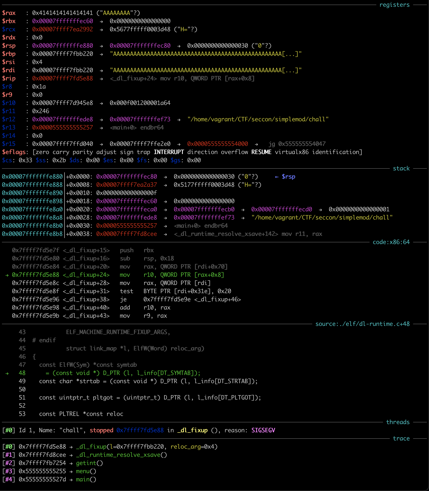
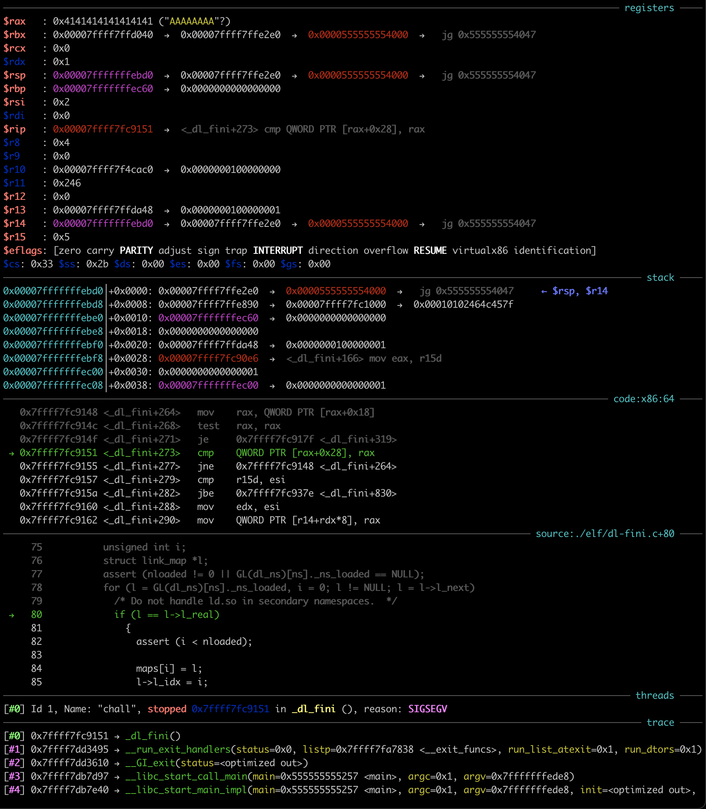

# simplemod

**Author**: [gallileo](https://twitter.com/galli_leo_) 

**Tags**: pwn, eldritch magic

**Points**: 470

After having a blast playing Codegate finals in Seoul the weekend before, we decided it would be fun to play SECCON Quals while [on vacation in Osaka](https://twitter.com/galli_leo_/status/1591329716187058176?s=20&t=FAqezxrJFtNrXLsi52Syrw).
Little did I know, what eldritch horror would await me in such an innocently named challenge.

## Setup

The challenge consists of a very simple main binary called `chall` and a dynamic library `libmod.so` which `chall` links against.
The source code for both is provided[^1] and `chall` is indeed very simple:

```c
#include <stdio.h>
#include <stdlib.h>
#include <unistd.h>

int getint(void);
void modify(void);
__attribute__((noreturn)) void exit_imm(int status);

__attribute__((constructor))
static int init(){
	alarm(30);
	setbuf(stdin, NULL);
	setbuf(stdout, NULL);
	return 0;
}

__attribute__((destructor))
static void fini(){
	exit_imm(0);
}

static int menu(void){
	puts("\nMENU\n"
			"1. Modify\n"
			"0. Exit\n"
			"> ");

	return getint();
}

int main(void){
	puts("You can operate 30 times.");
	for(int i=0; i<30; i++){
		switch(menu()){
			case 0:
				goto end;
			case 1:
				modify();
				puts("Done.");
				break;
		}
	}

end:
	puts("Bye.");
	return 0;
}
```

You have access to a simple menu allowing you to call `modify` up to 30 times, after which the binary will simply exit.
The three functions `getint`, `modify`, `exit_imm` are provided by `libmod` and hence dynamically linked.
`fini` immediately pops out as looking a bit suspicious.
It is a destructor, meaning it will be called before we exit.

`libmod` is not much more complex and looks as follows:

```c
#include <stdio.h>
#include <stdlib.h>
#include <stdint.h>
#include <unistd.h>

#define write_str(s) write(STDOUT_FILENO, s, sizeof(s)-1)

char gbuf[0x100];

static int getnline(char *buf, int size){
	int len;

	if(size <= 0 || (len = read(STDIN_FILENO, buf, size-1)) <= 0)
		return -1;

	if(buf[len-1]=='\n')
		len--;
	buf[len] = '\0';

	return len;
}

int getint(void){
	char buf[0x10] = {0};

	getnline(buf, sizeof(buf));
	return atoi(buf);
}

void modify(void){
	uint64_t ofs;

	write_str("offset: ");
	if((ofs = getint()) > 0x2000)
		return;

	write_str("value: ");
	gbuf[ofs] = getint();
}

__attribute__((naked))
void exit_imm(int status){
	asm(
		"xor rax, rax\n"
		"mov al, 0x3c\n"
		"syscall"
	   );
	__builtin_unreachable();
}
```

We now know the purpose of modify, it allows us to write a single byte at an offset `< 0x2000` from the start of `gbuf`.
However, `gbuf` only has a size of `0x100` bytes, so we have a trivial out-of-bounds write in modify!
We now also see what `exit_imm` does.
It directly calls the `exit` syscall, which might seem a bit peculiar.
Furthermore, both its declaration in `chall` and its definition here have some uncommon attributes.

The reason for directly calling the `exit` syscall is likely to force an immediate termination (as the name implies).
Calling libc's `exit` would instead result in the rest of the destructors etc. to run.
The various attributes are likely to cause a similar situation as in a previous CTF challenge, [nightmare](https://blog.pepsipu.com/posts/nightmare).
Indeed, disassembling `chall` we see the following:

```asm
fini:
    endbr64
    push    rbp
    mov     rbp, rsp
    mov     edi, 0
    call    _exit_imm

menu:
    endbr64
    push    rbp
    mov     rbp, rsp
    lea     rdi, s          ; "\nMENU\n1. Modify\n0. Exit\n> "
    call    _puts
    call    _getint
    pop     rbp
    retn
```

Therefore, if somehow `_exit_imm` would return instead of terminate the process immediately, we would end up back in the `menu` function, since there is no `ret` at the end of `fini`!
But there is some more work to be done, before we can get there.

## Finding a Useful Target for our OOB Write

As explained before, we have an OOB write of up to 30 bytes, up to `0x2000` away from `gbuf`.
`gbuf` is located in the data section of `libmod`, so what could we overwrite with this primitive?
A quick look at `vmmap` in gdb:

```python
gef➤  vmmap
[ Legend:  Code | Heap | Stack ]
Start              End                Offset             Perm Path
0x0000555555554000 0x0000555555555000 0x0000000000000000 r-- /home/vagrant/CTF/seccon/simplemod/chall
0x0000555555555000 0x0000555555556000 0x0000000000001000 r-x /home/vagrant/CTF/seccon/simplemod/chall
0x0000555555556000 0x0000555555557000 0x0000000000002000 r-- /home/vagrant/CTF/seccon/simplemod/chall
0x0000555555557000 0x0000555555558000 0x0000000000002000 r-- /home/vagrant/CTF/seccon/simplemod/chall
0x0000555555558000 0x0000555555559000 0x0000000000003000 rw- /home/vagrant/CTF/seccon/simplemod/chall
0x00007ffff7d8b000 0x00007ffff7d8e000 0x0000000000000000 rw-
0x00007ffff7d8e000 0x00007ffff7db6000 0x0000000000000000 r-- /home/vagrant/CTF/seccon/simplemod/libc.so.6
0x00007ffff7db6000 0x00007ffff7f4b000 0x0000000000028000 r-x /home/vagrant/CTF/seccon/simplemod/libc.so.6
0x00007ffff7f4b000 0x00007ffff7fa3000 0x00000000001bd000 r-- /home/vagrant/CTF/seccon/simplemod/libc.so.6
0x00007ffff7fa3000 0x00007ffff7fa7000 0x0000000000214000 r-- /home/vagrant/CTF/seccon/simplemod/libc.so.6
0x00007ffff7fa7000 0x00007ffff7fa9000 0x0000000000218000 rw- /home/vagrant/CTF/seccon/simplemod/libc.so.6
0x00007ffff7fa9000 0x00007ffff7fb6000 0x0000000000000000 rw-
0x00007ffff7fb6000 0x00007ffff7fb7000 0x0000000000000000 r-- /home/vagrant/CTF/seccon/simplemod/libmod.so
0x00007ffff7fb7000 0x00007ffff7fb8000 0x0000000000001000 r-x /home/vagrant/CTF/seccon/simplemod/libmod.so
0x00007ffff7fb8000 0x00007ffff7fb9000 0x0000000000002000 r-- /home/vagrant/CTF/seccon/simplemod/libmod.so
0x00007ffff7fb9000 0x00007ffff7fba000 0x0000000000002000 r-- /home/vagrant/CTF/seccon/simplemod/libmod.so
0x00007ffff7fba000 0x00007ffff7fbb000 0x0000000000003000 rw- /home/vagrant/CTF/seccon/simplemod/libmod.so # data section
0x00007ffff7fbb000 0x00007ffff7fbd000 0x0000000000000000 rw- # could likely overwrite into here
0x00007ffff7fbd000 0x00007ffff7fc1000 0x0000000000000000 r-- [vvar]
0x00007ffff7fc1000 0x00007ffff7fc3000 0x0000000000000000 r-x [vdso]
0x00007ffff7fc3000 0x00007ffff7fc5000 0x0000000000000000 r-- /usr/lib/x86_64-linux-gnu/ld-linux-x86-64.so.2
0x00007ffff7fc5000 0x00007ffff7fef000 0x0000000000002000 r-x /usr/lib/x86_64-linux-gnu/ld-linux-x86-64.so.2
0x00007ffff7fef000 0x00007ffff7ffa000 0x000000000002c000 r-- /usr/lib/x86_64-linux-gnu/ld-linux-x86-64.so.2
0x00007ffff7ffb000 0x00007ffff7ffd000 0x0000000000037000 r-- /usr/lib/x86_64-linux-gnu/ld-linux-x86-64.so.2
0x00007ffff7ffd000 0x00007ffff7fff000 0x0000000000039000 rw- /usr/lib/x86_64-linux-gnu/ld-linux-x86-64.so.2
0x00007ffffffde000 0x00007ffffffff000 0x0000000000000000 rw- [stack]
0xffffffffff600000 0xffffffffff601000 0x0000000000000000 --x [vsyscall]
```

We only have access to the data section and an unnamed region of memory right afterwards.
Since `libmod` is partial RELRO, its `got` is placed right in front of the data section, so we cannot overwrite anything in it[^2].
Additionally, there is nothing else of interest in the data section.

To figure out if there could be anything interesting to overwrite, I just overwrite the whole region I had access to with my primitive with `0x41` in gdb:

```c
gef➤ set *(char [0x2001]*)0x00007ffff7fba0c0 = "AAAAA...A"
```

I then told the binary to exit and was greeted with a nice `SIGSEGV`:



Clearly I was messing with some linker data structures!
I downloaded glibc source code (just assuming for now it was 2.34, more on that later) and started to look at where the crash occurred.
It was happening on some access to the passed in `l`, a `link_map` structure.
Indeed, by printing `l` in gdb I could see that I completely overwrite it with `0x41`:

```c
gef➤  p *l
$2 = {
  l_addr = 0x4141414141414141,
  l_name = 0x4141414141414141 <error: Cannot access memory at address 0x4141414141414141>,
  l_ld = 0x4141414141414141,
// ...
  l_relro_size = 0x4141414141414141,
  l_serial = 0x4141414141414141
}
gef➤
```

With some more debugging, I figured out that the `link_map` I was overwriting belonged to `libmod` and was at an offset of `0x1160` from `gbuf`.
Having previously looked at similar challenges (such as `nightmare`), it was clear that I had to cleverly overwrite the `link_map` to mess with the dynamic linker during runtime and cause it to somehow give me a shell (or equivalent to get the flag).
This was easier said than done of course and so we first have to understand how some internals of the dynamic linker on linux work.

## `link_map` Internals

For this writeup, it is not necessary to fully grasp all the details of the dynamic linker and I will try to describe the important bits as best as I can.

### `_dl_fixup`

First, we have to have a basic understanding, of how the got and friends work.
[Understanding `_dl_runtime_resolve()`](https://ypl.coffee/dl-resolve/) has a great in depth description, but we do not actually need to know some of the details provided, and some of the later steps are not described.

We all know that an external dynamic symbol creates an entry in the `got` and a relocation.
When the symbol is called for the first time, this symbol needs to be then resolved.
Further invocations use the stored resolved value, found in the `.got.plt` section.
To resolve the symbol during the first invocation, a stub function is called instead.
This stub function pushes the index of the relocation (index into the `JMPREL` table) as well as the address of the `link_map` of the current binary to the stack, then finally calls into the dynamic linker.
At some point, the dynamic linker will call into `_dl_fixup`, with the `link_map` and relocation index as arguments (the previous arguments will have been saved, so they can be used once the function has been resolved).

`_dl_fixup` will now do the following, assuming that we called `atoi` as an example, in `libmod`:

1. Use `link_map` to determine the location of a bunch of important tables / sections, such as `SYMTAB` (table of all symbols in the binary, both external and internal), `STRTAB` (table of names used by symbols) and `JMPREL` (containing the aforementioned relocation information)
2. Read the relocation from `JMPREL` (`+0x680`) based on the passed in index (`4`). This contains the following things:
    - Type of relocation (e.g. `ELF_MACHINE_JMP_SLOT` for a `got` relocation)
    - Index into the symbol table `SYMTAB` (`6`)
    - Offset from binary, where to write the resolved address to[^4] (`+0x4038`), the location of `atoi` in `.got.plt` in our case.
3. Read the symbol (named `ref` hereinafter) that should be resolved, by using the index from the relocation. This contains the following things (only relevant ones listed):
    - Index into the string table `STRTAB` (`0x66`) giving the name of the symbol.
    - Type of the symbol (e.g. `STT_FUNC` since `atoi` is a function).
    - Linkage visibility (e.g. `STB_GLOBAL`)
    - Section where the symbol can be found
    - Value (i.e. offset where the symbol can be found, in most cases) 
4. Read the name of the symbol from `STRTAB` by using `ref.st_name`.
5. Iterate over all currently loaded libraries, by iterating over all `link_map`s. For each `link_map`, do the following:
    1. Use some hash table magic to quickly determine if the name of the symbol is exported by this library.
    2. Use this to retrieve the symbol (named `sym` hereinafter) defined in the `SYMTAB` of the current `link_map`.
    3. Check that the name originally retrieved in 4. matches the name found at `STRTAB[sym.st_name]` of the current `link_map`.
    4. If yes, then return the found `sym`.
6. If we found the symbol in the previous step (let it be `sym` in `link_map` `map`), write `map.l_addr + sym.st_value` where the relocation told us to (`atoi@.got.plt` in the example), where `map.l_addr` specifies the base address of the library described by `map`.
7. Return `map.l_addr + sym.st_value`, so that the caller can also call into the resolved symbol (remember, originally we wanted to call e.g. `atoi` and to first resolve it).

Some of the referenced structures for the example `atoi` look as follows:

- Relocation for `atoi` in `libmod`:
```c
Elf64_Rela {
    r_offset = 0x4038,
    r_info = ELF64_R_INFO(6, ELF_MACHINE_JMP_SLOT),
    r_addend = 0
}
```
- Symbol for `atoi` in `libmod` (most fields are empty, since it is an external symbol): 
```c
Elf64_Sym {
    st_name = 0x66,
    st_info = ELF64_ST_INFO(STB_GLOBAL, STT_FUNC),
    st_other = 0,
    st_shndx = 0,
    st_value = 0,
    st_size = 0,
}
```
- Symbol for `atoi` in `libc` (will be used to fill in `atoi@.got.plt`, when `atoi` called the first time in `libmod`):
```c
Elf64_Sym {
    st_name = 0x4f60,
    st_info = ELF64_ST_INFO(STB_GLOBAL, STT_FUNC),
    st_other = 0,
    st_shndx = 0xf,
    st_value = 0x43640,
    st_size = 0x19,
}
```

Hopefully, this gives you enough of an understanding to follow the rest of the writeup.
However, we are unfortunately not quite done yet with linker internals.

### `_dl_fini`

Fortunately, this part should be a lot simpler to understand.
Whenever a dynamically linked binary terminates normally (e.g. calling `exit` or just returning from `main`), `_dl_fini` will be invoked first, to cleanup all the dynamically loaded libraries and call their registered destructors.
This looks something like this:

1. Collect all loaded libraries in a list, by iterating through all `link_map`s.
2. Sort them based on dependencies, but the main binary must always be first.
3. Iterate over the sorted list and for every `link_map`:
    1. Load the array specified by the `FINI_ARRAY` table from `link_map`.
    2. Call all functions in that array.
    3. Call the function specified by the `FINI` item from `link_map`, if it exists.

### `link_map.l_info`

The locations of these tables / sections (e.g. `SYMTAB`, `STRTAB`, `JMPREL`, `FINI_ARRAY`, `FINI`) are all stored in the `l_info` member of a `link_map`.
In particular, an entry in `l_info` is a pointer to a `struct Elf64_Dyn`, which is defined as follows:

```c
typedef struct
{
  Elf64_Sxword	d_tag;			/* Dynamic entry type */
  union
    {
      Elf64_Xword d_val;		/* Integer value */
      Elf64_Addr d_ptr;			/* Address value */
    } d_un;
} Elf64_Dyn;
```

Since the `d_tag` is never checked in any of the interesting `dl_*` functions, we can safely ignore that part and only worry about `d_un`.
`d_un` then stores a pointer to the relevant section / table in memory[^5].

With all this knowledge about dynamic linker internals out of the way, we can now finally delve into the actual exploit.

## `fini` is not the End of the Line

My hunch was now that I had to mess with my `link_map`, such that `_dl_fixup` will incorrectly resolve a symbol.
I played around a bit more with overwriting only parts of the `link_map`, but then I suddenly realized something.
I was crashing during the resolution of `atoi` - which was not resolved yet - since my writes were done entirely in gdb.
If my writes were done "properly" using `modify`, `atoi` would have been already resolved and I would not be crashing there.
I quickly retried, this time first doing one useless write of `0` to offset `0`, then overwriting in gdb and finally exiting:



It seems that my initial idea would be a bit harder to pull off, since all functions would be resolved already, right?
Not entirely, since `fini` of the main binary calls `exit_imm`, which of course has not been resolved yet.
By setting a breakpoint at `_dl_fixup` and not modifying the `link_map`, I indeed observed the call to `_dl_fixup` from inside `fini`:


This lead me to formulate a plan.

## Stage 1: Achieving Calls of Arbitrary Addresses Relative `libmod`

By modifying `l_info` of the `libmod` `link_map`, we can influence where the dynamic linker thinks `SYMTAB` and `STRTAB` are located.
In particular, we can make them be after the `gbuf` and hence arbitrarily attacker controlled.
We can therefore construct a fake symbol that is named `exit_imm`, but has a value (and hence resolved address) of anything we want.
Since the resolved address will be calculated as the value of the symbol (controlled) plus the base address of `libmod`, we can make `exit_imm` resolve to any address relative to `libmod`.
Because `exit_imm` is called, the resolved address is called and we hence have a call to an arbitrary address, relative to `libmod`.

### Home Grown vs. Store Bought libc

While we do not control the arguments that are passed to `exit_imm` (indeed `$rsi` is `0`, so resolving to e.g. `system` would never work), we "just" need to make `exit_imm` resolve to a one gadget in libc and we have a shell, right?
After all, shared libraries are always loaded at a constant offset from each other and so a relative offset from `libmod` can also get us addresses to libc gadgets.
Even though the constant offset is very dependent on the environment and we are not given a docker setup for this challenge, we can always bruteforce the offset in a pinch.

Unfortunately, the libc used on the server is "home-built glibc-2.3x".
Therefore, we can likely not use an one gadgets directly.
We might be able to also bruteforce the one gadget offsets, but it started to sound like this was not the intended way.

### It Works on my Machine!

After some discussion with the author over DMs, it was revealed that the remote had a modified dynamic linker, where the individual dynamic libraries were loaded at a random offset!
My current strategy would definitely not pan out then.
In my opinion, this crucial detail should have been included in the challenge description.
Furthermore, there should have been a docker setup, to test the challenge locally, as the offset between `gbuf` and `link_map` is highly dependent on the environment.
Therefore, I first had to bruteforce this offset on remote, which felt quite unnecessary.

To bruteforce the offset, I noticed that `_dl_fini` has some asserts, if triggered could be a good indicator that we hit the right offset.
In particular, it makes sure that for all `link_map`s, `link_map.l_real == link_map`.
Therefore, we could try to overwrite `link_map.l_real` for every possible offset, if we see the assertion message, we have hit the correct one.
However, if we accidentally overwrite `link_map.l_next` instead, then the assertion might still trigger, since the iteration will then use a bogus `link_map` next.
Hence, our actual target is `link_map.l_next` and to verify, we make sure that `offset+0x10` (i.e. overwriting `link_map.l_real`) also triggers the assertion.

This gives us an offset of `0x13e0` for the remote.

### Implementing the Attack

As explained before, we change the `link_map` such that `SYMTAB` and `STRTAB` are after `gbuf` and hence can be controlled by us as well, with the OOB writes.
To achieve that, I overwrite the lowest two bytes of the `Elf64_Dyn` pointer for `SYMTAB` and `STRTAB`, such that it now points inside the `l_info` array.
Therefore, `d_un` would contain pointers that were pointing somewhere relative to `libmod` and I could then overwrite the lowest two bytes of that pointer again to make `SYMTAB` and `STRTAB` point to after `gbuf`:

```c
// before overwrite
0x7ffff7fb9e98: Elf64_Dyn { d_tag = 5, d_un = 0x7ffff7fb6460 }
0x7ffff7fb9ea8: Elf64_Dyn { d_tag = 6, d_un = 0x7ffff7fb6328 }
// ...
0x7ffff7fbb220: link_map {
    // ...
    l_info[5] = 0x7ffff7fb9e98,
    l_info[6] = 0x7ffff7fb9ea8,
    // ...
0x7ffff7fbb330:
    l_info[26] = 0x7ffff7fb9e68,
    l_info[27] = 0x7ffff7fb9e58,
    // ...
}

// after overwrite
0x7ffff7fbb220: link_map {
    // ...
    l_info[5] = 0x7ffff7fbb330,
    l_info[6] = 0x7ffff7fbb330,
    // ...
0x7ffff7fbb330: Elf64_Dyn { d_tag = 0x7ffff7fb9e68, d_un = 0x7ffff7fba098 } // interpretation of two entries below
    l_info[26] = 0x7ffff7fb9e68,
    l_info[27] = 0x7ffff7fba098,
    // ...
}
```

**Note:** Since only the lowest 3 nibbles are not randomized by ASLR, this requires us to bruteforce the 4th nibble. It is only a 4-bit brute force though, so it is fine.
The official solution has a much better idea. Instead, we can just make the `l_info` entires for `SYMTAB` and `STRTAB` use the entry for a different section, that is much closer to `gbuf`, such as the `.got.plt` section.

Once we have `SYMTAB` and `STRTAB` under our control, it becomes pretty simple.
Observe the index into `SYMTAB` used for the `exit_imm` resolution, then create a fake symbol at that offset:

```c
Elf64_Sym {
    st_name = 0, // useful, since this means we need to call modify less often
    st_info = ELF64_ST_INFO(STB_GLOBAL, STT_FUNC),
    st_other = 0,
    st_shndx = 0xe,
    st_value = 0x1054, // whatever we want to call, this specific one will be explained later
    st_size = 0,
}
```

We also need to write `exit_imm` to `STRTAB` at the fake `STRTAB` location.
With that out of the way, we can proceed with the next stage.

## Stage 2: Achieving Calls to Arbitrary Functions by Name in libc

After realizing we could not directly call into libc using stage 1, I assumed we had to further trick the linker into e.g. calling system for us.
Indeed, I then realized I could use stage 1 to call one of the existing `got` stub functions and (even though everything was already resolved), it would try to resolve things again.
However, since the `link_map` is now under our control, we can change which symbol `_dl_fixup` will try to resolve.
Furthermore, since the stub function will call the resolved symbol, this also means we can call an arbitrary symbol, as long as one of the loaded libraries exports it.

### Implementation

**Note:** My exploit during the CTF created a fake relocation entry here. While writing this writeup, I realized this is actually not needed at all as becomes evident later!

First we have to modify `l_info` for `JMPREL`, such that we can create a fake relocation.
This is done the exact same way as before and `SYMTAB`, `STRTAB` and `JMPREL` are all at the same place.
Then, we make the fake relocation refering to a fake symbol which we want to resolve:

```c
Elf64_Rela {
    r_offset = 0x4038, // explained later why this is necessary
    r_info = ELF64_R_INFO(11, ELF_MACHINE_JMP_SLOT), // the symbol index here was necessary, since I ran out of bytes to write and this happens to point to something that can be interpreted as a valid symbol :)
    r_addend = 0,
}
```

As explained in the comment, the fake symbol is not really controlled this time around, but that does not matter.
The only important bit of the symbol is that the name index is not too large (so we can control the name).
The fake symbol will therefore be:

```c
Elf64_Sym {
    st_name = 0x1080,
    // ... some other values, we don't actually care
}
```

## Stage 3: Achieving Calls to Arbitrary Addresses Relative to libc?

At this point I could call arbitrary functions inside libc, but I had no control over the arguments.
In particular, `rdi` was fixed to 0, meaning `system` was just returning empty.
At this point, I was trying to pivot back to using a `one_gadget`.
I noticed that I could also reach libc's `link_map` with my OOB write.
Therefore, I could change `link_map.l_addr` for libc and hence mess with the resolved address for any function by adding a constant offset.
However, none of the `one_gadget`s of my local libc would work with the register state.
Furthermore, without the remote libc, it would still be very hard to actually exploit this.
I had to come up with a new idea.

## Stage 3: ~~Achieving Calls to Arbitrary Addresses Relative to libc?~~ Rewriting the GOT

Suddenly I remembered an important fact.
At the end of `_dl_fixup`, it would write the resolved address to whatever offset the relocation was specifying.
Indeed, if I would specify `atoi@.got.plt`, it would write whatever address it resolved (e.g. `system`) there and any further calls to `atoi` from `libmod` would instead call into `system`!
As explained at the very beginning, if the call to `exit_imm` returns normally instead of exiting immediately, control will flow into the menu function, which incidentally calls `getint`, eventually resulting in `atoi(getline())`, i.e. calling `atoi` with controlled input!
Therefore, I just had to specify `atoi@.got.plt` as the offset for the fake relocation and make sure `exit_imm` would return normally.
Indeed, since I replaced `exit_imm` with the call to the got stub function (which in turn calls `system`), it would return normally.

Although this idea should have only required minimal changes, during the CTF I had to rework quite a bit of my exploit, since it initially used one byte too much.

### No Shell For You

Unfortunately, when I tried this locally, it would crash during the final call to `system` (i.e. with the controlled argument), due to stack alignment.
My teammate jokingly suggested to just throw it against remote and I naivly assumed he was serious.
After around 40 attempts (remember it should only be a 4-bit bruteforce), I was just about to kill my tmux panes, when I noticed that one of them spat out the flag!
Good thing I thought my teammate was serious :P

### Later Realizations

As touched on before, this exploit does not actually need to have a fake relocation.
Indeed, we can just reuse the `atoi` relocation and everything works the same (besides having to create a fake symbol for `system`).
This alone saves around 5 bytes in the exploit.

## Conclusion

In the end, I learned a lot (actually way too much) about the internals of `ld`.
The challenge was kinda fun and invoking some eldritch linker magic to get the shell felt quite satisfying.
Nevertheless, I still think a local environment would have prevented some pain points, especially since I was not the only one who could not get the full exploit to work locally due to stack alignment.

You can find the original exploit I used during the CTF [here](https://gist.github.com/galli-leo/ae8ac3c0baa331d408a5de5212aeed76).
You can find a slightly modified version that does not need a fake relocation [here](https://gist.github.com/galli-leo/31ddf1861a19ffffba9bf1eb7d29aadb).


[^1]: Very much appreciated, I think more CTFs should start providing source for pwn challenges that do not need (IMO) unnecessary rev components.

[^2]: Or at least not without some eldritch magic, as you will see later ;)

<!-- [^3]: deez nuts, lmao `got`(em). -->

[^4]: This is important and took me way too long to use to my advantage.

[^5]: There is a flag in the `link_map` that turns the absolute addresses `d_un.d_ptr` into relative offsets from `link_map.l_addr`, but that ended up not being useful in my exploit.