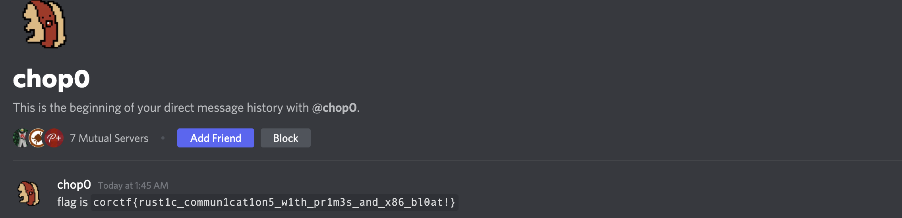

# circus

**Beware, the writeup below is a meme. I might make a legit writeup at some point, but today is not this day.**

**Authors:** [gallileo](https://twitter.com/galli_leo_)

**Tags:** rev, rust, meme

**Points:** 499

> I love Rust,
>
> Rust or Bust.
>
> Rust for life and 'til death do us part.
>
> Rust of the Rings!
>
> I do not like the garbage collector.
>
> It always gives me strife.
>
> It is the curse, that is our marriage,
>
> And I will hate it until I die.
>
> I'll run away and disavow it.
>
> My love for it will never grow.
>
> It used to be a healthy marriage,
>
> But it is over now.
>
> It was when Rust came out
>
> And start to use the memory-safe features
>
> As the garbage collector had no choice,
>
> But to accept that it was over as well.
>
> I'll not complain about memory safety.
>
> It is a good thing, I suppose.
>
> But when I need to mutate a single mapping,
>
> I want to be in charge of the mapping.
>
> I don't want to be told no,
>
> I want to have control over the flow.
>
>
> [circus.tar.xz](https://corctf2021-files.storage.googleapis.com/uploads/fe0ec7d942bdebae3284ab269da52ecdfbe8ba7a808ea2b2422ebf176203fb25/circus.tar.gz)

Reading the poem it's clear that the challenge will be in Rust.
Having reversed Rust before, I was prepared for the worst.
Luckily I had my trusty binary analysis tool [binary ninja (binja for short)](https://binary.ninja) [^1] read to go ham.

Loading up the binary in binja, it definitely looks like Rust. Thankfully, binja makes it look quite decent, nothing what it would like in inferior tools, like IDA or Ghidra[^2].
Here we first look at the main function:

## ASM

<iframe class="BinjaCloudEmbed" src="https://cloud.binary.ninja/embed/e398f80c-7cbe-4428-ad7a-9cc800873200" width="80%" height="800" style="position: absolute; left: 10%;" frameborder=0></iframe>

## HLIL

<iframe class="BinjaCloudEmbed" src="https://cloud.binary.ninja/embed/4dc7ba7c-1da3-4705-b1fb-271174b467cb" width="80%" height="800" style="position: absolute; left: 10%;" frameborder=0></iframe>

We see some kind of socket being opened and what looks like a message reading loop.
Even though it is rust, it still looks fairly readable thanks to binja[^3].
With some guessing, we figure out that `sub_96a0` is responsible for "decoding" our message.
We further inspect `sub_96a0`:

## ASM

<iframe class="BinjaCloudEmbed" src="https://cloud.binary.ninja/embed/d8365b93-8efc-4d40-91d1-0c39788b068b" width="80%" height="800" style="position: absolute; left: 10%;" frameborder=0></iframe>

## HLIL

<iframe class="BinjaCloudEmbed" src="https://cloud.binary.ninja/embed/2f17379b-cbf6-4fa4-8da0-2f42d55edace" width="80%" height="800" style="position: absolute; left: 10%;" frameborder=0></iframe>

This looks really cancerous, even without considering that we are dealing with a Rust binary.
Deciding that I don't want to deal with this right now, I just open a ticket with the admins and complain that the challenge is broken. Immediately I get recognized and things progress smoothly from there:

After sending some nice binja screenshots, I convinced the admins of my binja skills and they trusted me that the challenge was really broken.
Shortly afterwards, I receive a nice little DM:

*(Not included: The many hours spent actually revving it, getting it to work locally and then it actually being broken on the server - no cap - because it was too slow)*

[^1]: Trust me it is really the best out there, you should go and get it right now!

[^2]: It's even better than objdump if you can believe it!

[^3]: binja is awesome :)