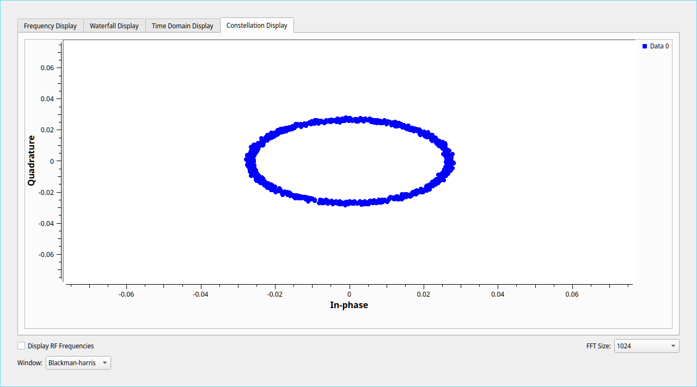

# Long Range

**Authors:** tritoke, dd
**Tags:** misc, radio
**Description:**
> In the Heat of the Night, Some RF signal was captured at 500.5MHz from Long Range.
> Attachment: sig.wav

To start we are given just a single WAV file, opening this up in audacity shows us what looks to be a few small packets of data and one larger one.


On closer inspection we can see that the packets contain Frequency Modulation (FM) data - due to the squishing and stretching of the wave.


As we are told this is RF data, it is likely that each of these channels represents on part of the complex sample, i.e. one part is the real component and the other is the imaginary component.

We can use GNU radio to read the file and visualise the complex samples.


Having a look at the constellation display shows a ring when a packet is being sent and a small cluster of dots in the center otherwise, this is more evidence that we are dealing with FM data.


Lets FM-decode the data and see how it looks in audacity.


Now this is some funky data, sawtooth waves mixed with reverse sawtooth waves, I didn't recognise this protocol at all and it took some inspired research from my teammate zeski to find that it was LoRaWAN.
This was confirmed by, umm, looking at the metadata of the file :/ 
This also clears up why we saw what looked like FM earlier, LoRa uses Spread Spectrum Modulation which is built on top of FM.

```xml
<?xml version="1.0"?>
<SDR-XML-Root xml:lang="EN" Description="Saved recording data" Created="04-Jan-2023 13:03">
    <Definition
        CurrentTimeUTC="04-01-2023 13:03:07"
        Filename="04-Jan-2023 210307.838 500.512MHz 000.wav"
        FirstFile="04-Jan-2023 210307.838 500.512MHz 000.wav"
        Folder="G:\chaitin\rw2022_lora"
        InternalTag="63B5-790B-0347"
        PreviousFile=""
        RadioModel="Airspy Mini"
        RadioSerial=""
        SoftwareName="SDR Console"
        SoftwareVersion="Version 3.0.28 build 2286"
        UTC="04-01-2023 13:03:07"
        XMLLevel="XMLLevel003"
        CreatedBy="L on FXXKER"
        TimeZoneStatus="0"
        TimeZoneInfo="IP7//<cut long base64 string...>"
        DualMode="0"
        Sequence="0"
        ADFrequency="0"
        BitsPerSample="16"
        BytesPerSecond="1500000"
        RadioCenterFreq="500512500"
        SampleRate="375000"
        UTCSeconds="1672837387"
    ></Definition>
</SDR-XML-Root>
```

So we now know the data is LoRaWAN, a bit of googling turns up [rpp0/gr-lora](https://github.com/rpp0/gr-lora), lets spin up the docker container and get solving.

Using the radio center frequency from the metadata and a bit of ✨ brute force ✨ we get the flag printed the debug log in hex:
```py
>>> s = "4e 31 70 57 65 6c 63 6f 6d 65 2c 20 42 65 20 41 20 52 57 43 54 46 65 72 21 20 72 77 63 74 66 7b 47 72 33 33 74 5f 46 72 30 6d 5f 4c 6f 52 34 5f 32 36 39 33 32 38 30 32 66 32 36 61 38 63 39 62 34 35 31 39 65 62 36 66 39 30 30 66 36 37 36 66 7d 83 c3"
>>> print(bytes.fromhex("".join(s.split())).decode())
b'N1pWelcome, Be A RWCTFer! rwctf{Gr33t_Fr0m_LoR4_26932802f26a8c9b4519eb6f900f676f}\x83\xc3'
```

`rwctf{Gr33t_Fr0m_LoR4_26932802f26a8c9b4519eb6f900f676f}`

Thanks to Real World CTF challenge, it was really interesting to learn more about LoRaWAN as it wasn't something I'd looked at in the past.
